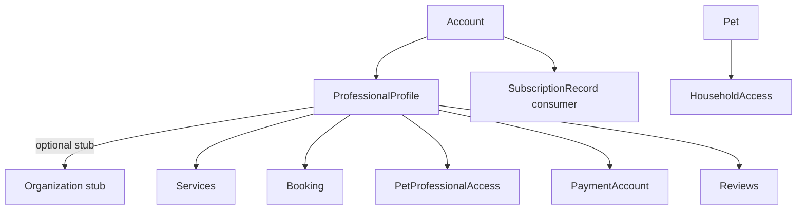
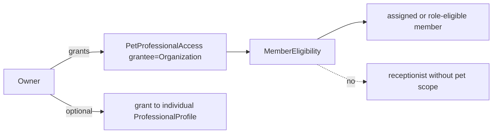

# KROK 41 — Organization & Workforce Architecture Audit

**Rozsah:** pouze audit + architektonický návrh. Žádný aplikační kód, nové runtime modely, storage, routes, UI ani migrace.  
**Zdroje:** `src/types/professional.ts`, `src/lib/booking/types.ts`, `src/lib/account/session.ts`, `src/lib/professional/*`, `src/lib/payments/*`, `src/lib/reviews/*`, `docs/K40-strategic-architecture-audit.md`.  
**Datum auditu:** 2026-09-12  
**Navazuje na:** K40 (Organization CRITICAL gap, workforce WARNING).

---

## A. Current Organization readiness

**NOT READY pro clinic / multi-worker / instituce.** Solo-professional marketplace je konzistentní; Organization je stub.

Dnes existuje (`src/types/professional.ts`):

```ts
export interface Organization {
  id: string
  type: ProfessionalType
  name: string
  memberAccountIds: string[]
  createdAt: string
  updatedAt: string
}
```

- Vytváří se jen pro `veterinary_clinic` | `shelter` (`ORGANIZATION_PROFESSIONAL_TYPES` v `src/lib/professional/types.ts`).
- `memberAccountIds` = flat list (typicky jen zakladatel); žádné role, invite, status.
- Runtime principál marketplace = **`ProfessionalProfile.id`** (Services, Availability, Booking, Reviews, Connect, PetProfessionalAccess, katalog).
- `Account.roles` míchá business typ (`veterinary_clinic`) s budoucími job rolemi — riziková konflace.



---

## B. Organization model recommendation

**Organization = samostatná doménová identita** (ne „Professional s jiným názvem“).

Navrhovaný minimální tvar (návrh, ne implementace):

| Pole | Účel |
|------|------|
| `id` | Stabilní identifikátor |
| `displayName` | Veřejný název |
| `legalName?` | Právní název (verification / payout) |
| `organizationType` | Typ organizace |
| `status` | `draft` \| `active` \| `suspended` \| `closed` |
| `publicVisibility` | `public` \| `private` |
| `createdAt` / `updatedAt` | Audit |

**OrganizationType mapping** (existující `ProfessionalType` **nepřepisovat**):

| Budoucí OrganizationType | Současný naming |
|--------------------------|-----------------|
| `veterinary_clinic` | `veterinary_clinic` (org-style) |
| `shelter` | `shelter` (org-style) |
| `breeder` | dnes `breeder` jako solo pro; později může mít Organization |
| `groomer` / `trainer` / `pet_hotel` / `pet_service` | stejné stringy; org vs solo podle existence Organization |
| `insurance` | nové (extensible `(string & {})`) |
| `public_institution` | nové (policie, obec, vet. úřad) |
| `other` | fallback |

**Pravidlo:** `AccountRole` / `ProfessionalType` zůstává **business identity jednotlivce**. OrganizationType žije na Organization. Org-style onboarding přestane znamenat „Account je klinika“ a začne znamenat „Account zakládá/členuje Organization“.

### Ownership (rozhodnutí)

Preferovaný produkční model: **Organization je samostatná identita s více owner/admin účty přes membership**.

- Zakladatel = první `OrganizationMembership` s rolí `owner`.
- Více `owner` / `admin` podporováno.
- Předání správy = změna membership rolí (ne přesun „vlastnictví Accountu organizace“).
- Odchod zakladatele = převod `owner` na jiného člena; Organization zůstává.

---

## C. Workforce recommendation

**OrganizationMembership** (Account ↔ Organization), ne flat `memberAccountIds`.

```
Account 1──* OrganizationMembership *──1 Organization
Account 1──* ProfessionalProfile          (individuální marketplace identita)
```

Jeden Account:

- může být v N organizacích,
- v každé s jinou rolí/statusem,
- může mít i vlastní solo `ProfessionalProfile` mimo org.

Minimální membership pole: `id`, `organizationId`, `accountId`, `role`, `status` (`invited` → `active` → `suspended` → `removed`), `invitedByAccountId?`, `joinedAt?`, `leftAt?`, `primaryLocationId?`, timestamps.

`ProfessionalProfile` **není** podmínkou membershipu (recepce nemusí mít veřejný katalogový profil). Pokud člen vykonává odborné služby veřejně, má `ProfessionalProfile` a membership ho spojuje s org.

### Employee departure lifecycle

| Událost | Dopad |
|---------|--------|
| Member invited → active | Smí jednat jménem org dle role/permissions |
| suspended | Dočasně bez org ops i pet eligibility |
| removed / left | Ztráta org permissions a pet eligibility; historické booking/review/audit záznamy zůstávají |
| Account blocked | Membership efektivně neaktivní; audit zachován |
| Account deleted | Membership ukončen; FK v historii přes snapshots / account tombstone |
| Organization closed | Všechny memberships ukončeny; org grants revoked; historie auditovatelná |
| Pet access revoked | Členové ztrácejí pet data i při aktivním membershipu |

---

## D. Role recommendation

Organization roles ≠ Pet permissions. Role ≠ access.

**Minimální produkční sada (ne všechny najednou):**

| Role | Smysl |
|------|--------|
| `owner` | Právní/provozní vlastnictví org (1+ účtů) |
| `admin` | Správa členů, nastavení, verification request |
| `manager` | Provoz (bookings, locations, services) bez nutnosti health |
| `professional` | Odborný výkon + kandidát na scoped pet access |
| `staff` | Obecný provozní člen |
| `receptionist` | Booking + komunikace; bez health default |
| `viewer` | Read-only org metadata |

Start implementace později: `owner` | `admin` | `professional` | `staff` | `viewer`. `manager` / `receptionist` jako specializace staff přes permissions.

---

## E. Permission recommendation

Dvě oddělené roviny:

1. **OrganizationPermission** — správa org (members, services, bookings inbox, payouts, public profile, locations).
2. **ProfessionalPermission** (existující) — pet data; zůstává na Pet grantu.

Org role **nikdy** neimplikuje `viewHealth` / microchip / owner PII. Recepce: booking + messaging. Veterinář: širší org ops + pet data **jen** přes Pet access. Manager: members/services, ne automaticky health.

---

## F. Pet access recommendation — **C: Organization + scoped member access**

Kritické rozhodnutí: **obojí**, s bezpečným defaultem.



**Model:**

- Owner udělí přístup **organizaci** (jeden grant místo 5 veterinářů).
- Efektivní pet data vidí jen člen, který:
  - má `OrganizationMembership.status = active`,
  - má org permission umožňující pet work **a**
  - je **in-scope**: assigned na booking/case, nebo role `professional` s explicitním org policy flagem `all_active_cases` (default **off** u citlivých dat),
  - a grant má potřebné `ProfessionalPermission[]`.
- Individuální grant na `ProfessionalProfile` zůstává pro solo / externí konzultanty.
- **Nesmí:** každý zaměstnanec kliniky automaticky vidět všechny pacienty.
- **Nesmí:** org membership nahrazovat `Pet.ownerAccountId` ani Household Access.

Existující `PetProfessionalAccess.professionalId` → budoucí `granteeType: 'professional' | 'organization'` + `granteeId` (additive, bez druhého access systému).

---

## G. Multi-location recommendation

Ano — minimální budoucí model:

```
Organization 1──* OrganizationLocation
OrganizationMembership.primaryLocationId?
Booking.locationId?
```

Location: `id`, `organizationId`, `displayName`, `city`, `status`, `publicVisibility`, timestamps.  
Jeden člen může pracovat na více locations (M:N membership↔location později; v1 stačí primary + booking.locationId).

---

## H. ProfessionalProfile relationship

**Čistší varianta: Account → OrganizationMembership** (+ samostatně Account → ProfessionalProfile).

| Vazba | Verdikt |
|-------|---------|
| Account → ProfessionalProfile | Ponechat — individuální profesionál |
| Account → OrganizationMembership | Primární workforce vazba |
| ProfessionalProfile.organizationId | Volitelný „affiliated / employed at“ pro katalog; ne SSOT membership |
| ProfessionalProfile → Membership | Nedělat jako jedinou vazbu (vylučuje recepci bez profilu) |

**NEVYTVÁŘET** druhý Professional model. Org-typed profile (`type: veterinary_clinic`) postupně přestat používat jako org principál; mapovat na Organization + případně „org public face“ projection.

---

## I. Service / Booking / Payment implications

### Services

- **Catalog owner:** Organization (klinika nabízí očkování, RTG…).
- **Provider:** volitelně `ProfessionalProfile` (specializace / kdo smí vykonat).
- Solo: `professionalId` zůstává owner služby (dnes OK).
- Jedna entita `ProfessionalService` — rozšířit o optional `organizationId` + `providerProfessionalIds[]`, ne druhý Service systém.
- `ProfessionalProfile.services: string[]` = tags; bookable rows zůstávají SSOT.

### Booking — stav readiness

| Potřeba | Stav |
|---------|------|
| `professionalId` (provider / calendar) | **OK** |
| `ownerAccountId`, `petId`, `serviceId` | **OK** |
| `organizationId` | **MISSING** |
| `locationId` | **MISSING** |
| `assignedProfessionalId` (když bookuje „kliniku“) | **WARNING** (dnes = jediný professionalId) |
| Staff acting on behalf of org | **MISSING** |

Bez překopání: additive optional fields + policy „solo = professional only; clinic = org + assignee“.

### Payments

- Solo: `ProfessionalPaymentAccount` na profile — OK.
- Klinika: **OrganizationPaymentAccount** (nebo generalizovaný Payee: `professional` \| `organization`) — payout jde org; employee provede službu (`Booking.assignedProfessionalId`).
- Platform fee zůstává na Payment; Membership subscription oddělená.
- Stripe neimplementovat teď; navrhnout vazby před Connect live.

### Reviews

- Stejný `ProfessionalReview` systém.
- Target: `professionalId` a/nebo `organizationId` (obě roviny).
- Booking completed → review může hodnotit providera, org, nebo obojí jedním záznamem s dvěma FK (ne druhý Review systém).

---

## J. Verification implications

Dnes: `subjectType: 'professional'` (+ user/pet/breeding); badge = profile status ∧ Verification record.

Budoucí: `subjectType: 'organization'` + org-level credentials/legal verification.  
verification ≠ membership ≠ role ≠ pet access.  
Katalog: org badge odděleně od individuálního veterinarian badge.

---

## K. Institutional readiness

OrganizationType `public_institution` + stejný membership/RBAC/scoped pet access/audit.  
Policie/útulek/obec **nikdy** nedostane globální přístup ke všem Petům — jen explicitní grant (emergency/L&F custody flow později).  
Dnes L&F/Emergency nemají institution actor — závisí na Organization + scoped access + audit (K40 §20).

---

## L. Security risks

| Riziko | Závažnost |
|--------|-----------|
| Org membership ⇒ implicit health access | CRITICAL design trap |
| Stavět clinic features na Profile-as-org | CRITICAL unwind cost |
| AccountRole = job role konflace | HIGH |
| Client-side ACL (localStorage) pro instituce | CRITICAL pro produkci (orthogonal, K40) |
| Org grant bez member scope | HIGH (všichni zaměstnanci vidí pacienty) |
| Public projection leak organizationId internals / PII | MEDIUM |
| Notification bez org context → wrong recipient | MEDIUM |

Privacy: existence Organization ≠ přístup k health, medications, documents, microchip, owner contacts, emergency private.

---

## M. Migration risks

Kdyby Organization přišla „až později“ bez designu teď:

| Oblast | Dopad |
|--------|--------|
| Modely | ProfessionalProfile jako falešná org; Booking/Payment/Review jen na professionalId |
| Routes | `/professionals/:id` jako clinic URL; chybí `/organizations` |
| Projections | PublicProfessionalProfile bez org surface |
| Storage | `lovedandknown.organizations` stub; vše ostatní na profile keys |
| Tests/asserts | K17–K39 předpokládají profile principal |
| UI | Catalog card org-style jen kosmetika |

Čím víc clinic bookingu/payoutů na solo profile, tím dražší unwind.

---

## N–Q. Priority backlog (design implications)

### N. CRITICAL

1. Organization jako samostatná identita + Ownership/Membership model.
2. Pet access = org grant + scoped members (ne all-staff).
3. Zastavit další clinic capacity na Profile-as-org.

### O. HIGH

4. OrganizationMembership lifecycle + roles.
5. Booking additive: `organizationId`, `locationId`, assignee.
6. Payment payee = org vs professional.
7. Oddělit AccountRole (business type) od org job roles.

### P. MEDIUM

8. OrganizationLocation.
9. Services owned by org + provider assignment.
10. Reviews dual target; Verification `organization`; notification `relatedOrganizationId`.
11. Public org profile rozšířením katalogu (ne paralelní katalog).

### Q. LOW

12. insurance / public_institution typy až po clinic path.
13. Rich org credentials UI.
14. Multi-location M:N member scheduling.

---

## R. Co NEMĚNIT

- Pet jako SSOT; `Pet.ownerAccountId`
- Household Access vs Professional Access oddělení
- `roleGrantsPetDataAccess() === false`
- Jediný Messages systém; žádný OrganizationChat
- Jediný AppNotification systém
- Projection / forbidden-key pattern
- Booking ≠ Payment ≠ Membership (subscription) ≠ Connect account on profile blob
- ProfessionalProfile jako reprezentace **jednotlivce**
- Existující ProfessionalPermission vocabulary (rozšiřovat opatrně, ne duplikovat)
- Přepisovat naming `ProfessionalType` stringů

---

## S. Co implementovat jako první (až po schválení auditu)

1. Doménový design freeze tohoto dokumentu (K41) — **hotovo**.
2. Rozšířit Organization stub → plný model + OrganizationMembership (bez UI clinic features) — **K42**.
3. Additive `PetProfessionalAccess` grantee organization + eligibility rules — **K43**.
4. Teprve pak: locations, org services, booking org fields, org payee, public org profile.

Pořadí musí předcházet server-side authority a clinical audit (K40 body 2–3) před reálnými klinikami.

---

## T. Doporučené KROKY po tomto auditu

1. **K42** — Organization + Membership model (types/storage/asserts), bez překopání Booking. *(oddělený implementační task — mimo rozsah K41)*
2. **K43** — Org-scoped Pet access (additive grantee) + eligibility.
3. **K44** — OrganizationLocation + Booking additive fields.
4. **K45** — Services org ownership + provider assignment.
5. **K46** — Org payee / PaymentAccount generalization (Stripe stále off).
6. **K47** — Public Organization profile v existujícím katalogu.
7. **K48** — Verification subject organization + trust signals.
8. **K49+** — Org messaging routing context, notifications org recipient, org audit trail, institutional actors.
9. Paralelně (K40): server ACL + clinical/security audit — blokuje produkční instituce i při hotovém org modelu.

---

## Messaging & Notifications (body 17–18)

- Messages zůstává jediný kanál.
- Konverzace: `participantAccountIds` + budoucí `organizationId` / `bookingId` kontext; routing na recepci vs assigned professional — ne nový chat.
- Owner → Organization (inbox členů s `messaging` permission) **nebo** Owner → konkrétní Professional (1:1 jako dnes).
- AppNotification: přidat později `relatedOrganizationId`; typy k rozšíření: `professional_access_*`, `booking_*`, `payment_*`, `professional_review_*`.

---

## Audit trail (body 19) — jen identifikace potřeby

Budoucí Organization audit events: member added/removed, role/permission changed, org verified, Pet access granted/revoked, sensitive record accessed.  
Neimplementovat v K41; oddělit od clinical content payloads (jako dnešní `ProfessionalAccessLog`).

---

## Public Organization profile (body 16)

Budoucí veřejný profil (návrh): název, typ, město, služby, specializace, otevírací doba, pobočky, verification, reviews, kontakt.  
Současný Professional catalog (`src/lib/professional/directory.ts`) lze rozšířit o org cards / společný query layer — **bez paralelního katalogu**.

---

## Duplicity check (body 23) — PASS pokud platí návrh

| Zakázaná duplicita | Jak se vyhnout |
|--------------------|----------------|
| 2. Professional model | Profile = individuál; Org = org |
| 2. Service / Booking / Review | Additive FK, jedna entita |
| 2. Messaging / Notification | Context fields only |
| 2. Access systém | Stejný PetProfessionalAccess + granteeType |
| 2. Pet model | Beze změny |
| 2. Public catalog | Org cards v directory / společný query layer |

---

## Finální tabulka

| OBLAST | SOUČASNÝ STAV | BUDOUCÍ POTŘEBA | RIZIKO | PRIORITA | DOPORUČENÍ |
|--------|---------------|-----------------|--------|----------|------------|
| Organization identity | Stub clinic/shelter | Plný model + type/status/visibility | CRITICAL | CRITICAL | Samostatná entita, ne Profile alias |
| Ownership | memberAccountIds flat | Multi owner/admin + transfer | HIGH | CRITICAL | Membership roles owner/admin |
| Workforce | Chybí | OrganizationMembership + lifecycle | CRITICAL | CRITICAL | Account↔Org, N org / account |
| Org roles | Chybí / konflace s AccountRole | owner…viewer odděleně od Pet | HIGH | HIGH | Role ≠ permission |
| Org permissions | Chybí | Ops permissions ≠ pet permissions | HIGH | HIGH | Dvě roviny ACL |
| Pet access | Jen ProfessionalProfile | Org grant + member scope | CRITICAL | CRITICAL | Model C |
| Multi-location | Jen city string | OrganizationLocation | MEDIUM | MEDIUM | Po membership |
| ProfessionalProfile | Solo principál (+ org-type fake) | Individuál + optional affiliation | HIGH | HIGH | Nepřepisovat; odpojit org principal |
| Services | professionalId only | Org catalog + provider | HIGH | HIGH | Additive organizationId |
| Booking | professionalId only | + org/location/assignee | HIGH | HIGH | Additive fields; OK jádro |
| Payments | Profile Connect | Org payee + employee performer | HIGH | HIGH | Generalizovat payee |
| Reviews | professional only | Professional a/nebo Org | MEDIUM | MEDIUM | Dual FK jednoho systému |
| Verification | professional subject | + organization subject | MEDIUM | MEDIUM | Nový subjectType |
| Public catalog | Profile directory | Org profile ve stejném katalogu | MEDIUM | MEDIUM | Extend, ne fork |
| Messaging | Account 1:1 | Org inbox context | MEDIUM | MEDIUM | Context na Conversation |
| Notifications | Account/professional related | + organization related | LOW–MED | MEDIUM | relatedOrganizationId |
| Audit trail | Pro access logs only | Org + sensitive access events | HIGH | HIGH | Po modelu, před institucemi |
| Institutional | NOT READY | Scoped access + audit | CRITICAL | CRITICAL | Závisí na org+server ACL |
| Privacy | Role≠access OK | Org≠health default | CRITICAL | CRITICAL | Explicit grant always |

---

## Přímá odpověď na klíčovou otázku

**Ano — Organization lze zavést bez překopání jádra Professional / Access / Booking / Payment**, pokud:

1. zůstane **additive** (nová entita + membership + optional FK),
2. Pet SSOT, Household, Messages, projections a `roleGrantsPetDataAccess === false` se **nemění**,
3. clinic přestane růst na „Profile jako organizace“,
4. Access/Booking/Payment dostanou **rozšíření polí a policy**, ne second system.

**Nutná je však změna směru (ne demolice):** přestat považovat org-typed `ProfessionalProfile` + stub `Organization.memberAccountIds` za finální clinic model. Bez tohoto design freezu by pozdější clinic features vynutily drahý rewrite principals.

**Verdikt shodný s K40:** jádro je zdravé; chybí doplnit Organization/Workforce vrstvu — nepřepisovat to, co K1–K40 správně položilo.

---

## Out of scope (K41)

- Žádné změny v `src/`
- Žádné nové runtime typy / storage / routes / UI / migrace
- **K42** (Organization + Membership implementace) je oddělený následný task
