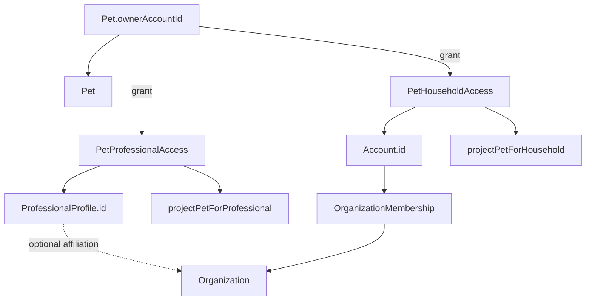
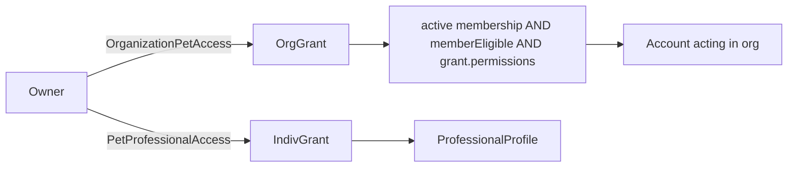

# KROK 43 — Organization-Scoped Pet Access Audit

**Rozsah:** pouze audit + architektonický návrh. Žádný aplikační kód v tomto kroku (implementace = K44).  
**Zdroje:** K41 doc, K42 runtime (`src/types/organization.ts`, `src/lib/organization/*`), Pet ownership, `PetProfessionalAccess`, `PetHouseholdAccess`, projections, AppNotification, booking privacy.  
**Datum auditu:** 2026-09-12  
**Navazuje na:** K41 §F (org grant + scoped members), K42 (Organization + Membership bez pet access).  
**Design freeze:** model **C** (+ kompatibilita s individual B) se samostatným **`OrganizationPetAccess`** — **ne** `granteeType` uvnitř `PetProfessionalAccess`.

---

## 1. Current architecture



| Doména | Grantee | Permission vocab | Lifecycle | Projection |
|--------|---------|------------------|-----------|------------|
| Ownership | `Pet.ownerAccountId` | plný (mimo projection keys) | N/A | owner path |
| Professional | `professionalId` | `ProfessionalPermission[]` | pending/active/revoked/expired | `projectPetForProfessional` |
| Household | `accountId` + role defaults | `HouseholdPetPermission[]` | stejný status model | `projectPetForHousehold` |
| Organization | **žádný pet grant (před K44)** | jen org-ops (`organization_*`) | membership invited→active→suspended→removed | `toPublicOrganization` (metadata only) |

**Stabilní invarianty (NESMÍ se měnit):**

- `roleGrantsPetDataAccess() === false`
- Membership ≠ pet access
- Booking ≠ PetProfessionalAccess
- Microchip / owner PII nikdy v professional/household/org projections
- Oddělené SSOT: Professional Access vs Household Access

**K42 dodalo:** Organization, OrganizationMembership, org RBAC, membership notifikace, professional UI.  
**K42 nedodalo:** org→pet grant, health přes org, booking.organizationId, payments, verification, audit trail pet access přes org.

---

## 2. Problem definition

Owner potřebuje udělit přístup **klinice jako instituci** k **jednomu Petovi**, aniž by:

- musel grantovat každého zaměstnance zvlášť,
- každý člen kliniky automaticky viděl Bellu,
- odchod zaměstnance vyžadoval revoke pet grantu,
- Organization role sama o sobě znamenala health/microchip/PII.

Dnes jde pet access jen na `ProfessionalProfile` nebo household `Account` — chybí bezpečný instituční grantee.

---

## 3. Grantee model comparison

| | A: Owner→Organization grant only | B: Owner→Professional only (status quo) | C: Org grant + scoped members | D: Hybrid (org grant + optional individual) |
|--|--|--|--|--|
| **Security** | Slabé, pokud všichni members dědí grant | Silné per-person, UX neškáluje | Silné při AND eligibility | Stejné jako C + solo path |
| **UX** | 1 grant, rizikový default | N grantů na kliniku | 1 grant + org policy | Klinika + externí konzultant |
| **Revocation** | 1 revoke = všichni pryč | N revoke | 1 org revoke; member remove odděleně | + nezávislý individual revoke |
| **Employee departure** | Spoléhá na membership cut | Grant zůstává na osobě | Membership cut stačí | Org path OK; individual zvlášť |
| **Auditability** | Org-level | Person-level | Org + membership + assignment | Nejlepší |
| **Multi-location** | Později location scope | Špatně mapuje na kliniku | Grant + optional locationScope | Stejně |
| **Institutions** | Připravené | Nevhodné | Připravené | Připravené |
| **Health** | Riziko all-staff | Explicit perms OK | Grant perms ∩ eligibility | Stejně |
| **Migration risk** | Střední | Nízké | Střední | Střední; PPA netknutý |

**A** selže bez member scope. **B** neřeší clinic UX. **C** je požadovaná sémantika. **D** = C + zachování individual `PetProfessionalAccess`.

---

## 4. Recommended model

**Doporučení: C (+ D jako kompatibilita se stávajícím B)**

- **Sémantika:** Organization-level pet grant + member eligibility (K41 §F).
- **Entita:** samostatný **`OrganizationPetAccess`** (Pet → Organization), **ne** `granteeType` uvnitř `PetProfessionalAccess`.
- **Důvod oproti K41 granteeType:** Professional Access je stabilní SSOT; consumery očekávají `professionalId`. Oddělená entita = stejný pattern jako Household vs Professional.
- **Individual `PetProfessionalAccess` zůstává** pro solo / externí konzultanty.
- **Žádný** unified `PetAccess` model.
- **Reuse** `ProfessionalPermission[]`, projection/forbidden-key pattern, AppNotification systém.



---

## 5. Organization access lifecycle

Budoucí `OrganizationPetAccess`:

| Pole | Účel |
|------|------|
| `id` | Stabilní ID |
| `petId` | Scope: vždy konkrétní pet |
| `organizationId` | Grantee instituce |
| `permissions` | `ProfessionalPermission[]` (reuse) |
| `status` | `pending` \| `active` \| `revoked` \| `expired` |
| `visibilityMode` | `assigned_only` \| `role_eligible` (default **`assigned_only`**) |
| `eligibleRoles?` | Jen při `role_eligible`; default `['professional']` |
| `assignedAccountIds?` | Účty eligible při `assigned_only` (K44 minimální assignment) |
| `locationId?` | Budoucí; ne v K44 |
| `grantedByAccountId`, `requestedAt?`, `grantedAt`, `expiresAt?`, `revokedAt?` | Lifecycle jako PPA |
| timestamps | Audit |

**Lifecycle:** `pending` → `active` → `revoked` \| `expired`. Soft revoke.  
**Scope:** vždy `organization → specific pet`. Nikdy all-pets bez explicitního grantu.

---

## 6. Permission resolution

Tři vrstvy (AND):

1. **Grant effective?** status active (+ expires/revoked guards).
2. **Member eligible?** active membership **a** (assigned **nebo** role_eligible ∧ role ∈ eligibleRoles).
3. **Permission present?** `grant.permissions.includes(required)`.

```
effectiveOrgPetAccess(actor, pet, org) =
  grantEffective(pet, org)
  AND membershipEffective(actor, org)
  AND memberPetEligible(actor, pet, org, grant)
  AND hasPermission(grant, action)
```

**Role ≠ health.** OrganizationPermission / OrganizationRole nikdy neimplikují `viewHealth`.  
Owner / Co-owner / Caregiver / Viewer: beze změny.  
Individual professional grant: nezávislý OR path přes `PetProfessionalAccess`.

### Employee visibility (klinika X → Belle)

| Actor | Identita | Health R/W | Documents | Microchip | Owner contact | Revoke org grant |
|-------|----------|------------|-----------|-----------|---------------|------------------|
| Eligible professional | ano (grant active) | jen explicit perms | jen `viewDocuments` | **ne** | **ne** | **ne** |
| staff / viewer / admin / org owner | **ne** default | ne | ne | ne | ne | ne (admin může remove členy) |
| Pet Owner | ano | ano | ano | ano | ano | **ano** |
| Membership bez grantu | ne | ne | ne | ne | ne | ne |

---

## 7. Employee departure

| Co | Výsledek |
|----|----------|
| Membership → `removed` | ok |
| OrganizationPetAccess | **beze změny** |
| Přístup přes org | **okamžitě ne** |
| Historie | zachována |
| Individuální PPA | nezávislé |

---

## 8. Revocation

Owner (`assertPetOwner`) → `revoked` + `revokedAt`.  
**Nemaže:** Pet, Organization, Memberships, ProfessionalProfile, Booking, history.  
Org admin nemůže obejít owner revoke.

---

## 9. Projection

`projectPetForOrganization` — stejný pattern jako `projectPetForProfessional`: identity + permission-gated health/docs; forbidden microchip/owner PII; neefektivní → `{ petId }`.

---

## 10–11. Health / microchip privacy

Organization: žádný implicit health. Microchip / owner contacts: nikdy přes org grant (budoucí explicitní legal path pro instituce). Vždy per-pet scope.

---

## 12. Institutional readiness

Stejný model pro `shelter` / `public_institution`. Nikdy globální přístup ke všem Petům.

---

## 13. Booking implications

Booking může spustit **access request** (pending). Booking **NESMÍ** auto-vytvořit active health access. Assignment na booking = kandidát na eligibility (později).

---

## 14. Notification implications

Rozšířit AppNotification:

- `organization_access_requested`
- `organization_access_granted`
- `organization_access_revoked`

`relatedAccessId` = org-pet-access id. Privacy scrub jako u ostatních builders.

---

## 15. Security threats

| Threat | Severity |
|--------|----------|
| Employee privilege escalation (role→health) | CRITICAL |
| Removed employee still accessing Pet | CRITICAL |
| Access inheritance (membership⇒all pets) | CRITICAL |
| Health leakage via org projection | CRITICAL |
| Microchip / owner PII leakage | HIGH |
| organizationId tampering / cross-org | HIGH |
| Role escalation | HIGH |
| petId enumeration | MEDIUM |
| Client-side ACL only (localStorage) for institutions | CRITICAL (prod, orthogonal K40) |

---

## 16. Migration risks

| Oblast | Změna | Riziko |
|--------|-------|--------|
| Pet / PPA / Household | netknuto | LOW |
| Organization | FK jako grantee | LOW |
| Membership | eligibility reader | MEDIUM |
| Projections / notifications | additive | LOW–MEDIUM |
| K41 granteeType plán | **nahrazen** oddělenou entitou | docs ALIGN |

---

## 17–20. Priority

**CRITICAL:** membership ≠ pet; per-pet grant + eligibility AND; default `assigned_only`; soft revoke + departure via membership.  
**HIGH:** oddělená entita; reuse ProfessionalPermission; owner-only revoke; PPA paralelní.  
**MEDIUM:** request/grant notifikace; booking assignment later; locationId later.  
**LOW:** institution microchip paths; rich assignment UI.

---

## 21. What MUST NOT change

- Pet SSOT + `assertPetOwner`
- `PetProfessionalAccess` (žádný granteeType rewrite)
- `PetHouseholdAccess`
- `roleGrantsPetDataAccess === false`
- Membership ≠ pet access; Booking ≠ automatic health
- Jediný AppNotification; projection forbidden-key pattern
- Žádný unified PetAccess / druhý permission vocab

---

## 22. K44 implementation scope

1. Typ + storage `OrganizationPetAccess`
2. Effectiveness + eligibility (`assigned_only` default)
3. Owner grant / revoke / approve pending session API
4. `projectPetForOrganization` + safety asserts
5. Notification builders (3 typy)
6. Assert script (membership alone ≠ pet; departed blocked; revoke keeps org/membership)
7. **Ne:** location scope, booking auto-wire, payments, verification, microchip rules, UI clinic EMR

---

## Explicitní odpověď

Owner vytvoří **jeden** `OrganizationPetAccess` (petId + organizationId + explicitní `ProfessionalPermission[]`, default `visibilityMode: assigned_only`). Klinika pracuje s Petem jen přes členy s **aktivním membership** a **eligibility** (přiřazení, nebo úzký `role_eligible` jen pro `professional`). Role/membership samy o sobě neotevírají health/microchip/PII. Odchod = `OrganizationMembership.removed` → ztráta eligibility; org→pet grant zůstává; historie zůstává; individuální PPA je oddělený. Owner revoke ukončí přístup celé kliniky bez mazání org/členů/záznamů.
