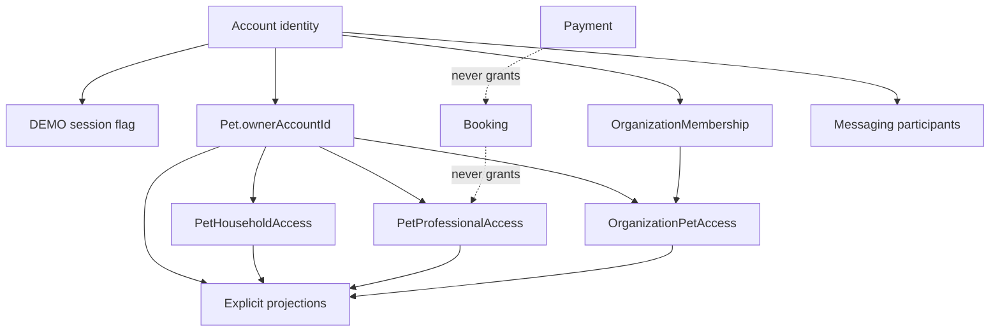
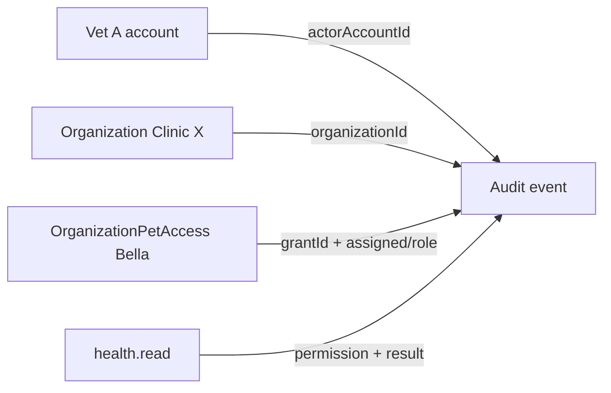

# KROK 45 — Security + Audit Trail Architecture Audit

**Rozsah:** pouze audit + architektonický návrh.  
**Žádný kód, model, storage, route, UI, migrace, auth ani audit trail implementace.**  
**Datum auditu:** 2026-09-12  
**Zdroje:** `src/types`, `src/lib/*/access.ts`, `src/lib/*/project.ts`, `src/lib/account/session.ts`, existující client logy, assert skripty, K40 §7/§15, K41, K43, runtime K42/K44.  
**Navazuje na:** [K40-strategic-architecture-audit.md](K40-strategic-architecture-audit.md), [K41-organization-workforce-architecture.md](K41-organization-workforce-architecture.md), [K43-organization-scoped-pet-access-audit.md](K43-organization-scoped-pet-access-audit.md).

**Aktualizace K40:** Organization už není stub. Workforce (`Organization` + `OrganizationMembership`) a `OrganizationPetAccess` existují (K42/K44). Stále chybí server authority, centrální audit a purpose-based instituce.

**Stabilní invarianty (NESMÍ se měnit):**

- ownership ≠ access
- role ≠ permission
- membership ≠ pet access
- professional access ≠ household access
- organization membership ≠ organization pet access
- booking ≠ health access
- payment ≠ membership
- membership ≠ verification
- `roleGrantsPetDataAccess() === false`
- raw entity ≠ public authority (explicitní projekce)

---

## Finální verdikt

**ČÁSTEČNĚ.**

Doménový model je připravený jako serverový kontrakt: ownership ≠ access, role ≠ permission, membership ≠ pet access, booking ≠ health, payment ≠ membership, explicitní projekce. Runtime ale není produkční security: veškerá autorita žije v localStorage, session je DEMO boolean, existující logy jsou klientsky přepisovatelné a neúplné, `OrganizationPetAccess` nemá žádný audit, health READ/WRITE nemá serverovou stopu, actor ≠ organization se autorizuje, ale neaudituje.

Architektura říká *kdo smí co*. Backend ještě nerozhoduje *zda se to stalo* a *kdo to skutečně provedl*.

---

## 1. Security boundaries



### Account / session

| Akce | Kdo |
|------|-----|
| READ | self (`owner_self`) |
| WRITE | self role add / onboarding; žádné heslo, token, revoke |
| GRANT / REVOKE / DELETE | neexistuje server session |

- **Authority:** CLIENT DEMO — `lovedandknown.sessionActive` + hardcoded `SELF_OWNER_ID`.
- **Soubor:** `src/lib/account/session.ts`

### Pet ownership

| Akce | Kdo |
|------|-----|
| READ / WRITE / DELETE pet | owner (`Pet.ownerAccountId`) |
| GRANT / REVOKE access | pouze owner (`assertPetOwner`) u household a org→pet |
| Transfer | zakázán (`transferPetOwnership` throws) |

- **Authority:** BACKEND READY jako kontrakt; MUST BE SERVER AUTHORITY v runtime.
- **Soubor:** `src/lib/pets/ownership.ts`

### Household Access

| Akce | Kdo |
|------|-----|
| READ / WRITE | owner plně; člen jen při effective grant + `HouseholdPetPermission` |
| GRANT / UPDATE / REVOKE | owner only |
| Accept / reject / suspend / restore | neimplementováno (`pending` jen extension) |

- **Authority:** owner; role jen default, stored permissions jsou SSOT.
- **Soubory:** `src/lib/household/access.ts`, `src/lib/household/types.ts`

### Professional Access

| Akce | Kdo |
|------|-----|
| READ / WRITE pet data | effective grant + `ProfessionalPermission` (read ≠ write) |
| GRANT / ACTIVATE / REVOKE | zamýšleno owner; `grantPetAccess` / `revokeAccess` / `activateAccess` **nevolají** `assertPetOwner` |
| REQUEST | professional → pending, bez dat |

- **Authority:** grant; mezera: chybí owner assert (horizontal IDOR na `accessId`).
- **Soubor:** `src/lib/professional/access.ts`

### Organization Membership

| Akce | Kdo |
|------|-----|
| READ org | member; public jen `toPublicOrganization` při `public` |
| WRITE settings / GRANT invite / REMOVE / SUSPEND / ROLE | `organization_*` perms (owner/admin) |
| ACCEPT / REJECT | jen invitee |
| RESTORE / ownership transfer | chybí / throws |

- **Authority:** org-ops, nikdy pet health.
- **Soubor:** `src/lib/organization/access.ts`

### Organization Pet Access

| Akce | Kdo |
|------|-----|
| READ / WRITE | AND gate — effective grant + active membership + eligibility + permission |
| GRANT / ACTIVATE / REVOKE / ASSIGN | owner (`assertPetOwner`) |
| REQUEST | org side → pending |

- **Authority:** grant + member actor. Membership samotné nikdy neotevře kartu.
- **Soubor:** `src/lib/organization/petAccess.ts`

### Booking

| Akce | Kdo |
|------|-----|
| CREATE | owner |
| READ | owner nebo professional |
| CONFIRM / DECLINE / CANCEL / COMPLETE / NO-SHOW | podle actoru; paid confirm jen webhook path |
| GRANT health | nikdy |

- **Authority:** `ownerAccountId` / `professionalId`.
- **Soubor:** `src/lib/booking/bookings.ts`

### Payment

| Akce | Kdo |
|------|-----|
| READ | owner / professional (public projekce bez secrets) |
| CREATE intent | owner checkout |
| STATE WRITE | provider webhook; DEMO nesmí inventovat paid |

- **Authority:** Payment entita ≠ audit trail.
- **Soubor:** `src/lib/payments/types.ts`

### Messaging

| Akce | Kdo |
|------|-----|
| READ / WRITE | `participantAccountIds` |
| bookingId | nikdy nestačí |
| Legacy | thread bez participants je otevřený (DEMO) |

- **Authority:** participant list.
- **Soubor:** `src/lib/messaging/conversations.ts`

### Emergency / Lost & Found / QR

| Akce | Kdo |
|------|-----|
| Private write | owner; household `emergency_write` / `lost_manage` (co-owner default bez `lost_manage`) |
| Public READ | bearer token/slug + allowlist projekce |
| Professional / org | žádný L&F / emergency grant |

- **Authority:** owner + bearer knowledge. Emergency slug často = `pet.id` (enumerace).

### Public / professional / household / organization projections

Všechny explicitní allowlist. Raw entity nikdy není public authority.

| Projekce | Soubor | Typ |
|----------|--------|-----|
| Public Discover pet | `src/lib/privacy/project.ts` | `projectPublicPet` |
| Discover sanitizer | `src/lib/discover/privacy.ts` | `sanitizeDiscoverPet` |
| Household pet | `src/lib/household/project.ts` | `HouseholdPetView` |
| Professional pet | `src/lib/professional/project.ts` | `ProfessionalPetView` |
| Organization pet | `src/lib/organization/petProject.ts` | `OrganizationPetView` |
| Public professional | `src/lib/professional/public.ts` | `toPublicProfessionalProfile` |
| Public organization | `src/lib/organization/project.ts` | `toPublicOrganization` |
| Booking pet/owner | `src/lib/booking/privacy.ts` | `projectPetForBooking` |
| Public payment | `src/lib/payments/privacy.ts` | `toPublicPayment` |
| Lost pet public | `src/lib/lostPet/publicView.ts` | `buildLostPetPublicView` |
| Found / QR public | `src/lib/foundPet/publicView.ts` | `buildFoundPetPublicView` |
| Emergency card public | `src/lib/emergencyCard/publicView.ts` | `buildEmergencyCardPublicView` |

---

## 2. Authority model

Rozlišení, které systém už má a musí zachovat:

| Pojem | SSOT |
|-------|------|
| identity | `Account.id` |
| role | `AccountRole` / `OrganizationRole` / `HouseholdPetRole` — nikdy data access |
| membership | `OrganizationMembership` (workforce) |
| permission | stored list (`HouseholdPetPermission` / `ProfessionalPermission` / `organization_*`) |
| resource ownership | `Pet.ownerAccountId` |
| resource access | grant (household / professional / org-pet) |
| public visibility | projection + privacy level + opt-in flag |

Konzistence checks:

| Check | Stav |
|-------|------|
| authentication | CLIENT DEMO |
| authorization | doménově konzistentní, client-enforced |
| ownership checks | household + org-pet ANO; professional mutations NE |
| permission checks | ANO v access/project vrstvách |
| projection checks | ANO, forbidden keys |
| resource scoping | ANO v pravidlech; ID lookupy (`getPayment`, `getBooking`) bez actor scope |

Backend rizika (až bude server, pokud se jen zrcadlí client):

- **IDOR:** professional access by `accessId`; payment/booking by URL id.
- **Horizontal escalation:** cizí grant/revoke; čtení cizího pet blobu z localStorage.
- **Vertical escalation:** `addSelfAccountRole` odemyká `/professional/*` a org create; `backfillMembershipsFromStubMemberIds` může vyrobit owner membership.
- **Confused deputy:** org actor jedná „jako klinika“ bez zalogovaného account; booking/payment nesmí eskalovat na health.
- **Cross-org:** dnes 1 self account; po multi-org nutný org v každé decision.
- **Stale / revoked reuse:** status machines existují; enforcement jen client read-time.

---

## 3. Audit requirements

Budoucí centrální audit event (doporučený tvar, **neimplementovat, model nevytvářet**):

| Pole | Účel |
|------|------|
| `eventId` | UUID, server-issued |
| `timestamp` | server time, ne client clock |
| `actorAccountId` | skutečná osoba |
| `actorType` | account / system / provider / anonymous_finder |
| `action` | z taxonomie (§20) |
| `resourceType` + `resourceId` | cíl akce |
| `result` | success / denied / error |
| `organizationId?` | kontext, ne náhrada actora |
| `membershipId?` + `grantId?` + `grantType?` | který grant/membership rozhodl |
| `permission?` | rozhodnutí, které prošlo/selhalo |
| `correlationId` / `requestId` | traceability |
| `idempotencyKey?` | opakovaný ingest |
| `metadata?` | jen allowlisted, scrubbed |

**Nesmí** být pole: password, token, session secret, CVV, raw chip, raw PII, raw message, clinical payload.

Existující `ProfessionalAccessLog` / `PetHouseholdAccessLog` = CLIENT DEMO domain history. Nejsou produkční audit. **Nepřidávat** třetí `organizationPetAccessLogs` do localStorage.

---

## 4. Sensitive data matrix

| Třída | Data |
|-------|------|
| PUBLIC | Discover pet allowlist, public professional/org, public review, lost/found/emergency public views, public membership summary |
| INTERNAL | booking pet `{petId, petName}`, public payment, org-ops membership, notification metadata, webhook event ids |
| PRIVATE | private bio, calendar, gallery, conversation metadata, household roster, private professional fields |
| SENSITIVE | health records, medications, vaccinations, documents, verification records, access grants, message content, emergency contacts, owner contacts, org who-works-where |
| HIGHLY_SENSITIVE | full microchip, laboratory, owner phone/email/address, emergency private notes, payment credentials (nesmí existovat), Connect `providerAccountId`, session secrets, SafeContact exchanged phone, verification metadata/docs |

Povinně auditovat (až server): grant/revoke/role/permission/expiry; health WRITE; clinic/org health READ; document READ/WRITE pro non-owner; microchip/PII READ; emergency/L&F status; owner/org admin akce; booking lifecycle; payment state/refund/payout/webhook; messaging create/deny (ne text); security denials.

Owner self-read vlastního peta: **product decision** (default: neauditovat).

---

## 5. Health audit

**Kritické.**

Současný stav:

- `HealthRecord` se přepisuje in-place, bez author / createdAt (K40 §6).
- Laboratory není entita — jen document `lab_results` + calendar `lab`.
- Professional projekce umí `record_viewed` / `document_viewed` jen když `logViews` — actor je `professionalId`, ne account (`src/lib/professional/project.ts`).
- Organization projekce **neloguje** vůbec (`src/lib/organization/petProject.ts`).
- Household neloguje READ ani WRITE.

Minimální budoucí požadavky:

| Akce | Povinnost |
|------|-----------|
| health WRITE | povinný (owner i non-owner klinické mutace) |
| medication WRITE | povinný |
| vaccination changes | povinný |
| health state changes | povinný |
| document WRITE | povinný |
| health READ (professional / organization / institution) | povinný |
| document READ (non-owner, zvláště lab) | povinný pro kliniku |
| health READ (owner self / household) | volitelný — product decision |

Veterinář / klinika musí umět rekonstruovat: kdo (`actorAccountId`), z jaké org, pod jakým grantem, jakou permission, jaký resource, výsledek, čas.

**READ audit ≠ WRITE audit.** Clinical ledger (version/author) je **oddělený** od security audit. Neslučovat. Clinical versioning = budoucí krok (K51), ne tento.

---

## 6. Microchip / owner PII audit

Dnes správně:

- žádné `viewMicrochip` / `viewOwnerContacts` v `ProfessionalPermission` (KROK 17 — never auto-granted);
- projekce je stripují;
- emergency umí jen maskovaný chip;
- Lost / Found / QR nikdy full chip ani owner contacts;
- SafeContact telefon až po mutual consent.

Chybí: jakýkoliv „kdo k tomuto údaji přistoupil a proč?“

Budoucí audit metadata (ne raw hodnota):

- `resourceType` = `microchip` | `owner_contact` | `emergency_contact` | `safe_contact`
- `accessReasonCode?` — volitelný kód, ne volný text s PII

**Purpose** pro policii / obec = **future legal/product decision**. Nový privacy model nevytvářet.

---

## 7. Organization audit

Scénář: Clinic X → Pet Bella. Členové: Vet A, Vet B, Receptionist C, Admin D.



Rozlišení, které audit musí zachovat:

| Vrstva | Význam |
|--------|--------|
| Organization access | existuje grant Clinic X → Bella |
| Member access | A je `active` + eligible (`assigned_only` / `role_eligible`) |
| Actual actor | `actorAccountId` Vet A |

Audit **nesmí** říct pouze „Organization X accessed Bella“. Musí jít určit konkrétního aktéra.

- Receptionist C bez eligibility → `ACCESS_DENIED`, ne ticho.
- Admin D mění membership → `MEMBERSHIP_CHANGED`, ne health event.
- Vet A otevře kartu Belly → `HEALTH_VIEWED` s `actorAccountId` + `organizationId` + `grantId` + permission.

Dnes `actorHasOrganizationPetPermission` má actor, ale žádný persistovaný event.

---

## 8. Access grant audit

Auditovat pro Household, Professional, Organization membership i Organization pet:

- grant
- accept
- reject
- revoke
- suspend
- restore
- role change
- permission change
- expiration

Historický stav **musí** zůstat: snapshot permissions / role / status v metadata (ne raw PII). Current row přepsat smí; audit řádek ne.

Současný stav:

| Layer | Grant/revoke log | Role/perms | Suspend/restore | Accept/reject |
|-------|------------------|------------|-----------------|---------------|
| Household | ANO (client) | ANO | NE | NE (`pending` extension) |
| Professional | ANO (client) | perms update | NE | request/activate |
| Org membership | NE | NE | suspend ANO, restore NE | invite accept/reject |
| Org pet | **NE** | assignment update bez logu | NE | request/activate |

---

## 9. Admin / owner actions

| Akce | Závažnost |
|------|-----------|
| change pet owner (zakázáno) | CRITICAL |
| organization ownership transfer (zakázáno) | CRITICAL |
| takeover session / ACL | CRITICAL |
| add co-owner | HIGH |
| remove household member | HIGH |
| org member remove / suspend / role | HIGH |
| professional access revoke | HIGH |
| org pet access revoke / assignment | HIGH |
| emergency visibility / PII flags | HIGH |
| Lost & Found status lost→found/closed | HIGH |
| permission tweak / expiry change | MEDIUM |
| booking reschedule | MEDIUM |
| review report | MEDIUM |
| public Discover flags | LOW |
| display name / UI workspace | LOW |

---

## 10. Booking audit

Auditovat metadata, ne pet health:

- create
- confirm
- decline
- cancel
- reschedule
- complete
- no-show

Pole: actor + `bookingId` + `petId` + `professionalId` + from/to status.

Booking entita zůstává SSOT lifecycle. Audit je oddělený. Booking ≠ `PetProfessionalAccess`.

---

## 11. Payment audit

Audit trail **musí** být oddělený od `Payment` entity. Nový payment systém nevytvářet.

Auditovat:

- create payment intent
- payment state change
- refund
- payout state
- webhook event (received / processed / duplicate / failed)
- Connect account state

`lovedandknown.payment_provider_events` = provider ingest / dedupe, **ne** user audit. Neslučovat.

Žádné card / CVV / IBAN v auditu. DEMO nesmí tvrdit live paid.

---

## 12. Messaging audit

Jen metadata:

- conversation created
- message sent (`messageId` only)
- marked read
- access denied
- participant added / removed

**Nikdy raw text zprávy.** Legacy open threads (bez `participantAccountIds`) = CLIENT DEMO díra.

---

## 13. Security events vs business audit

**Business audit:** `ACCESS_GRANTED` / `ACCESS_REVOKED`, `HEALTH_VIEWED` / `HEALTH_UPDATED`, `DOCUMENT_*`, `MEMBERSHIP_*`, `ROLE_CHANGED`, `BOOKING_CHANGED`, `PAYMENT_CHANGED`.

**Security events:** `ACCESS_DENIED`, invalid scope, permission denied, revoked reuse, cross-org attempt, invalid ownership, suspicious repeated access.

Dvě streamy, jeden `correlationId`. Neslučovat do jedné tabulky, dokud retention / access policy nejsou oddělené (security log nesmí číst běžný owner UI).

---

## 14. Immutability

Požadavky budoucího server auditu:

- append-only
- tamper resistance (princip; hash chain / WORM = infra decision až po server store)
- server timestamp
- actor identity
- event ID
- correlation ID
- idempotency

Uživatel nesmí update / delete. Audit nesmí být běžná funkce, kterou lze přepsat.

Client `appendAccessLog` dnes **není** immutable — DevTools přepíše `lovedandknown.professionalAccessLogs` / `lovedandknown.petHouseholdAccessLogs`.

---

## 15. Retention

| Oblast | Typ rozhodnutí |
|--------|----------------|
| Health access / clinical-adjacent | legal / compliance decision |
| Payment / payout / webhook | legal / compliance decision |
| Organization / professional access grants | legal + product |
| Security events | legal + product |
| Account / onboarding / UX | product decision |

Právní lhůty neurčovat, pokud je nelze bezpečně určit. DEMO localStorage retention = none (user wipe).

---

## 16. Privacy / minimization

Audit trail **NESMÍ** obsahovat:

- hesla
- tokeny
- session secrets
- CVV
- celé payment credentials
- raw microchip, pokud není nezbytný (default: ne)
- raw owner PII
- raw message content

Vzor už existuje v `src/lib/professional/audit.ts` a `src/lib/household/audit.ts`. Budoucí centrální scrubber musí být přísnější (i `medication` / `healthRecord` hodnoty, nejen klíče).

---

## 17. Server authority

| Označení | Příklady |
|----------|----------|
| CLIENT DEMO | session flag; login bez credentials; localStorage ACL; professional mutations bez owner assert; payment DEMO webhook; entitlements DEMO; verification `local_demo`; household demo accounts; emergency slug = `pet.id`; messaging legacy open; client audit logs; `addSelfAccountRole` |
| BACKEND READY (kontrakt) | ownership; household / pro / org permission vocabs; AND gate org-pet; projekce + forbidden keys; booking ≠ access; payment ≠ booking confirm; role ≠ permission; membership ≠ pet access; SafeContact; opaque tokens; Connect account off profile |
| MUST BE SERVER AUTHORITY | authentication; všechny grant mutace; health / document / PII read-write; authorization decision; audit ingest; webhook signature; payment / payout state; session revoke; public bearer resolve + rate limit |

---

## 18. LocalStorage risks

**Security authority (nedůvěryhodné):**

`sessionActive`, `accounts`, `pets` (`ownerAccountId`), `petHouseholdAccess`, `petProfessionalAccess`, `organizations`, `organizationMemberships`, `organizationPetAccess`, `healthRecords`, `petDocuments`, `payments`, `professional_payment_accounts`, `payment_payouts`, `payment_provider_events`, `bookings`, `inboxConversations`, lost / safe contact stores, `verifications`, `subscription`, `privacySettings`, `notifications`, existující domain logs.

**UX state:**

`uiWorkspace`, `discoverFilters`, drafts, onboarding flag, display name / city, engagement, daily care, notification prefs.

Logout maže jen workspace, ne ACL. localStorage **nikdy** není důvěryhodný security boundary.

---

## 19. Projection audit

| Surface | Projector | Raw entity smí být public authority? |
|---------|-----------|--------------------------------------|
| public Pet / Discover | `projectPublicPet` + `sanitizeDiscoverPet` | NE |
| public Professional | `toPublicProfessionalProfile` | NE |
| public Organization | `toPublicOrganization` | NE |
| Discover | catalog + sanitizer | NE |
| Emergency | `buildEmergencyCardPublicView` | NE |
| Lost & Found | `buildLostPetPublicView` | NE |
| QR / Found | `buildFoundPetPublicView` | NE |

Public output musí zůstat explicitní allowlist. Zbývající rizika: UI čte raw `Pet`; Discover sanitizer obejít; emergency opt-in health; bearer token = access; client má celý blob v localStorage.

---

## 20. Threat matrix

| THREAT | IMPACT | LIKELIHOOD | SEVERITY | CURRENT MITIGATION | MISSING MITIGATION | PRIORITY |
|--------|--------|------------|----------|--------------------|--------------------|----------|
| IDOR | high | high if client copied to server | HIGH | client getters | actor scope na každém read/mutate | P0 |
| Privilege escalation | critical | high | CRITICAL | domain denies role-only | server ACL + professional owner assert | P0 |
| Cross-org access | high | medium later | HIGH | AND gate | org na každé decision + audit | P1 |
| Stale membership | high | medium | HIGH | status cut | restore/audit + server revalidate | P1 |
| Stale pet access | high | medium | HIGH | `expiresAt` read-time | server expiry job + audit | P1 |
| Revoked user access | high | medium | HIGH | status revoked | security event + deny audit | P0 |
| Leaked microchip | critical | low–med | HIGH | forbidden keys | server projection + slug enum | P1 |
| Leaked owner PII | critical | low–med | HIGH | projections / SafeContact | access audit + server | P0 |
| Health leakage | critical | medium | CRITICAL | permission projectors | READ audit + server | P0 |
| Payment leakage | high | low | HIGH | no secrets stored | server webhook verify | P1 |
| Audit tampering | critical | high today | CRITICAL | none (LS writable) | immutable server log | P0 |
| Notification leakage | medium | medium | MEDIUM | `recipientAccountId` | server recipient check | P2 |
| Public projection leakage | high | low if path followed | MEDIUM | allowlists | server-only project | P1 |
| localStorage manipulation | critical | certain in hostile client | CRITICAL | accepted DEMO | server authority | P0 |

---

## 21. Event taxonomy

Pouze doporučení. **Neimplementovat. Nepřidávat notification types. Nepřidávat nový event systém.**

Business:

- `ACCESS_REQUESTED`
- `ACCESS_GRANTED`
- `ACCESS_ACTIVATED`
- `ACCESS_REJECTED`
- `ACCESS_REVOKED`
- `ACCESS_SUSPENDED`
- `ACCESS_RESTORED`
- `ACCESS_EXPIRED`
- `ROLE_CHANGED`
- `PERMISSION_CHANGED`
- `MEMBERSHIP_CHANGED`
- `HEALTH_VIEWED`
- `HEALTH_UPDATED`
- `MEDICATION_UPDATED`
- `VACCINATION_UPDATED`
- `DOCUMENT_VIEWED`
- `DOCUMENT_UPDATED`
- `PII_VIEWED`
- `EMERGENCY_CHANGED`
- `LOST_FOUND_CHANGED`
- `BOOKING_CHANGED`
- `PAYMENT_CHANGED`
- `PAYOUT_CHANGED`
- `CONNECT_ACCOUNT_CHANGED`
- `MESSAGE_SENT`
- `CONVERSATION_CREATED`
- `PARTICIPANT_CHANGED`

Security:

- `ACCESS_DENIED`
- `SCOPE_INVALID`
- `REVOKED_ACCESS_ATTEMPT`
- `CROSS_ORG_ATTEMPT`
- `OWNERSHIP_INVALID`
- `SUSPICIOUS_REPEATED_ACCESS`

---

## 22. Traceability

Požadovaný chain:

```
requestId
  → actorAccountId          (Vet A)
  → organizationId?         (Clinic X)
  → membershipId?
  → grantId                 (OrganizationPetAccess Bella)
  → permission              (health.read)
  → resource                (pet / health)
  → result                  (success | denied)
```

Dnes: org autorizace má actor + membership + grant, ale žádný event. Professional log má `professionalId`, ne account, ne org. Household log má account, jen grant mutace. Correlation / request neexistuje.

---

## 23. Institutional readiness

`OrganizationType` obsahuje `public_institution`. Chybí police / municipality actor, purpose, warrant / scope. Globální přístup je správně zakázán.

Každý budoucí přístup musí mít:

- actor
- scope
- purpose / context (**future legal/product decision**)
- permission
- auditability

Bez globálního přístupu. **NOT READY.**

---

## 24. Incident response

Budoucí schopnost (neimplementovat incident system) musí umět odpovědět:

- kdo měl přístup
- kdy
- k čemu
- z jaké organizace
- jakou permission měl
- zda byl přístup později revoke
- zda přístup pokračoval po revoke

Dnes nelze spolehlivě — client logs neúplné, org-pet bez logu, health READ skoro žádný, logy přepisovatelné.

---

## 25. Duplication risks

Nesmí vzniknout:

- druhý auth systém
- druhý ACL
- druhý permission systém
- druhý notification systém
- druhý projection systém
- audit log uvnitř každé domény
- paralelní security authority

**Centrální audit boundary:** jeden server ingest za authorization decision. Domény emitují fakt; audit store je jeden. Reuse `ProfessionalPermission` / `HouseholdPetPermission` / `organization_*`. Existující client logy neexpandovat; později je označit legacy.

---

## 26. Migration

Budoucí server audit by vyžadoval (pouze návrh):

- nové entity (ne teď)
- nové storage (immutable append)
- backend middleware (`authn → actor context → authorize → mutate → audit`)
- authorization service nad existujícími vocabs
- event ingestion + idempotency
- immutable storage
- indexy (actor, org, resource, grant, time, correlation)
- retention jobs

**Ne:** nové permission typy, nové notifikace, nové projekce, audit uvnitř `Payment` / `HealthRecord`.

---

## 27. CRITICAL

- Žádná server identity / session.
- localStorage = security authority (XSS = takeover).
- Audit trail není serverový ani immutable.
- Organization pet access bez actor auditu (Clinic X vs Vet A).
- Health / PII READ + WRITE bez důvěryhodné stopy.
- Professional grant / revoke bez `assertPetOwner`.

**Proč:** produkční backend by jinak zrcadlil client-trust model. U klinik a institucí nelze odpovědět „kdo otevřel kartu“.

---

## 28. HIGH

- Neúplný grant lifecycle (suspend / restore, household invite).
- Professional log actor = profile, ne account.
- Emergency slug enumerace (`publicSlug` často = `pet.id`).
- IDOR-shaped getters (`getPayment`, `getBooking`).
- Health overwrite bez clinical version.
- Chybí security event stream.
- Institution purpose access chybí.

**Proč:** doménová pravidla existují, ale stopa, actor a public identifier nestačí na incident response ani na server copy-paste.

---

## 29. MEDIUM / LOW

**MEDIUM**

- Household / owner READ neauditován.
- Messaging deny / legacy open threads.
- Notification leakage na serveru.
- Lab není first-class entita.
- Admin / moderation chybí (K40).
- Tři messaging planes (inbox / SafeContact / found).

**LOW**

- Owner self-read policy.
- UX keys v localStorage.
- Mock Discover katalog.

---

## 30. Recommended K46+

K40 plán (K42 auth, K46 audit bus) byl přepsán org prací K41–K44. Nové pořadí:

### K46 — Server Security Context architecture (design only)

- **Účel:** request actor context (account, org, membership, grant, correlation).
- **Závislosti:** tento audit.
- **Implementovat:** jen dokument / kontrakt.
- **Neimplementovat:** auth systém, storage, middleware, UI.
- **Riziko:** uvařit druhý identity model.

### K47 — Authorization Decision architecture (design only)

- **Účel:** jedna decision funkce nad existujícími vocabs; deny = security event.
- **Závislosti:** K46.
- **Implementovat:** kontrakt rozhodnutí (allow / deny + reason).
- **Neimplementovat:** nový ACL, nové permissions.
- **Riziko:** přepsat household / pro / org do jednoho megamodel.

### K48 — Central Audit ingest architecture (design / types-only if needed)

- **Účel:** taxonomy + privacy scrub + business vs security streams.
- **Závislosti:** K46–K47.
- **Implementovat:** kontrakt ingestu.
- **Neimplementovat:** localStorage logy, notifikace, UI timeline.
- **Riziko:** audit log per domain.

### K49 — Server authority hardening plan (migration, no live auth yet)

- **Účel:** které mutace MUST move first (grants, health, PII, payments webhook).
- **Závislosti:** K46–K48.
- **Implementovat:** migration plan.
- **Neimplementovat:** Stripe live, clinic EMR.
- **Riziko:** ship client ACL jako „dočasný backend“.

### K50 — Professional access owner-assert (úzký client fix, pouze pokud ještě není server)

- **Účel:** `assertPetOwner` na grant / activate / revoke / update — ne nový model.
- **Závislosti:** žádné.
- **Implementovat:** owner assert v existujících funkcích.
- **Neimplementovat:** změnu `PetProfessionalAccess` shape.
- **Riziko:** považovat to za produkční security.

### K51 — Clinical record versioning design

- **Účel:** author + append / version, odděleně od security audit.
- **Závislosti:** K48.
- **Implementovat:** design only.
- **Neimplementovat:** clinic UI, lab FHIR.
- **Riziko:** slít clinical ledger s audit bus.

### K52 — Emergency / QR public identifier hardening

- **Účel:** slug ≠ `pet.id`, server resolve + rate limit.
- **Závislosti:** K49.
- **Implementovat:** opaque public identifier.
- **Neimplementovat:** nový privacy model.
- **Riziko:** enumerace emergency karet.

### K53 — Institution purpose access (future decision)

- **Účel:** police / obec / shelter purpose + scope bez global access.
- **Závislosti:** K46–K48 + legal.
- **Implementovat:** nic nyní.
- **Neimplementovat:** globální institucionální přístup.
- **Riziko:** purpose bez právní opory.

### K54 — Admin / moderation + incident query

- **Účel:** číst audit, ne ho zapisovat z UI.
- **Závislosti:** server audit.
- **Implementovat:** read-only incident query.
- **Neimplementovat:** owner-editable log.
- **Riziko:** audit jako běžná CRUD entita.

---

## Tabulka

| OBLAST | SOUČASNÝ STAV | SERVER REQUIREMENT | RIZIKO | PRIORITA |
|--------|---------------|--------------------|--------|----------|
| Session / auth | DEMO flag `owner_self` | server identity + revoke | CRITICAL | P0 |
| Pet ownership | kontrakt OK, LS writable | server assert | HIGH | P0 |
| Household access | pravidla OK + client log | server mutate + historický snapshot | HIGH | P1 |
| Professional access | pravidla OK, chybí owner assert, client log | server + actor account | CRITICAL | P0 |
| Org membership | RBAC OK, bez auditu, bez restore | server + membership events | HIGH | P1 |
| Org pet access | AND gate OK, **žádný audit** | actor + org + grant event | CRITICAL | P0 |
| Health | consumer records, overwrite | WRITE + clinic READ audit; ne EMR v auditu | CRITICAL | P0 |
| Documents / lab | permission OK | READ / WRITE audit | HIGH | P0 |
| Microchip / owner PII | never granted | `PII_VIEWED` bez raw value | HIGH | P0 |
| Emergency / L&F / QR | projekce OK, slug weak | server bearer + status audit | HIGH | P1 |
| Booking | oddělené od access | lifecycle audit metadata | MEDIUM | P2 |
| Payment / Connect | entita SSOT, provider events ≠ audit | oddělený payment audit | HIGH | P1 |
| Messaging | participants OK, legacy open | metadata only | MEDIUM | P2 |
| Notifications | derived emitters | recipient check; žádný 2. systém | MEDIUM | P2 |
| Projections | allowlist OK | server-only project | MEDIUM | P1 |
| localStorage | celý DB | nesmí zůstat authority | CRITICAL | P0 |
| Existing domain logs | client append | legacy; nenahrazují central audit | HIGH | P0 |
| Institutions | type exists, purpose ne | future decision | HIGH | P3 |

---

## Potvrzení rozsahu

- žádný kód nezměněn
- žádný nový model vytvořen
- žádný nový storage vytvořen
- žádný nový notification systém
- žádný nový auth systém
- žádná změna `PetProfessionalAccess`
- žádná změna `PetHouseholdAccess`
- žádná změna `OrganizationPetAccess`
- žádná změna Booking / Payment
- **POUZE AUDIT + ARCHITEKTONICKÝ NÁVRH**
