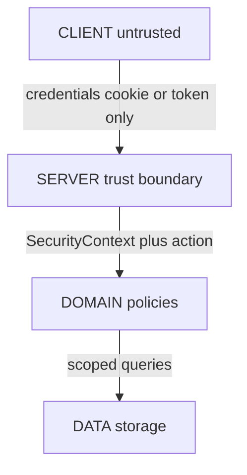
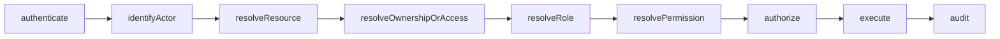

# KROK 46 — Server Security Context + Authorization Architecture

**Rozsah:** pouze audit + architektonický návrh.  
**Žádný kód, model, storage, route, UI, migrace, server auth, audit trail ani změna existujících access modelů.**  
**Datum auditu:** 2026-09-12  
**Zdroje:** `src/lib/account/session.ts`, `src/lib/pets/ownership.ts`, `src/lib/household/access.ts`, `src/lib/professional/access.ts`, `src/lib/organization/petAccess.ts`, `src/lib/*/project.ts`, localStorage keys, K45.  
**Navazuje na:** [K45-security-audit-trail-architecture.md](K45-security-audit-trail-architecture.md), [K43-organization-scoped-pet-access-audit.md](K43-organization-scoped-pet-access-audit.md), [K41-organization-workforce-architecture.md](K41-organization-workforce-architecture.md), [K40-strategic-architecture-audit.md](K40-strategic-architecture-audit.md).

**Stabilní invarianty (NESMÍ se měnit):**

- ownership ≠ access
- role ≠ permission
- membership ≠ pet access
- professional access ≠ household access
- organization membership ≠ organization pet access
- booking ≠ health access
- payment ≠ health access
- payment ≠ membership
- raw entity ≠ public authority (explicitní projekce)
- `roleGrantsPetDataAccess() === false`

**Cíl K46:** navrhnout SERVER-SIDE SECURITY CONTEXT, na kterém později stojí authorization, access decisions, audit trail, health / organization / professional / household access, booking, payment a public projections — **bez implementace**.

---

## Finální verdikt

**ANO.**

Je možné bezpečně vytvořit server-side authorization layer **bez přepisování** existujících access domén (`PetHouseholdAccess`, `PetProfessionalAccess`, `OrganizationPetAccess`).

Doménové hranice, permission vocabs, effective/expiry checks, org AND gate a allowlist projekce už tvoří budoucí server kontrakt. Chybí trusted actor (`SecurityContext`) a jednotný authenticate → authorize → execute → audit glue — ne nový unified `PetAccess` model.

**Výhrada (neblokuje verdikt):** runtime je stále CLIENT DEMO (localStorage + session boolean); professional grant/revoke bez `assertPetOwner`; legacy messaging threads. To řeší K49–K50, ne sloučení domén.

---

## 1. Current authority

Dnes je autorita **CLIENT DEMO**:

| Vrstva | Stav |
|--------|------|
| Session | `lovedandknown.sessionActive` boolean; missing key = active (`src/lib/account/session.ts`) |
| Identity | hardcoded `SELF_OWNER_ID` (`owner_self`) |
| Actor | UI předá `actorAccountId` / `getSelfAccount()?.id` |
| ACL | localStorage grants + `Pet.ownerAccountId` |
| Guards | doménové `assert*` / `can*` — kontrakt UX, ne server security |
| SecurityContext | **neexistuje** |

| Akce | Kdo rozhoduje dnes |
|------|--------------------|
| READ self account | DEMO session + `owner_self` |
| WRITE onboarding / roles | client `addSelfAccountRole` / complete onboarding |
| Pet ownership assert | `assertPetOwner` s client-supplied actor |
| Household / Pro / OrgPet access | client libs nad localStorage |
| GRANT / REVOKE | client; HH + OrgPet volají `assertPetOwner`; Pro grant **ne** |

Doménové hranice jsou připravené jako budoucí server kontrakt. Runtime jim **nelze věřit**.

K45 ukázalo: ownership ≠ access, role ≠ permission, membership ≠ pet access, Professional / Household / OrganizationPetAccess jsou samostatné, public projections jsou explicitní — ale session je DEMO, OrganizationPetAccess nemá spolehlivou actor audit stopu, health READ/WRITE nemá důvěryhodný server-side trace.

---

## 2. Trust boundaries



### Co je nedůvěryhodné

Server **NESMÍ** věřit hodnotám, které může klient libovolně změnit:

- localStorage (celý současný „DB“)
- client-supplied `accountId` / `actorAccountId`
- client-supplied `organizationId`
- client-supplied role
- client-supplied permissions
- client-supplied `ownerAccountId`
- client-supplied access status (`active` / `revoked` / …)
- UI workspace (`sessionStorage` `uiWorkspace`) jako „jsem professional“

### Co je důvěryhodné (pouze server)

- authenticated session → `actorAccountId`
- membership lookup z DB
- grant lookup z DB
- `Pet.ownerAccountId` z DB
- permission lists na grant row z DB
- server clock pro expiry
- server-issued `correlationId` / `requestId`

---

## 3. SecurityContext

Budoucí contract (soubory / typy **nevytvářet** v tomto kroku):

```ts
// CONCEPT ONLY — not created in this step
type SecurityContext = {
  correlationId: string
  requestId: string
  channel: 'web' | 'mobile' | 'worker' | 'webhook' | 'public'
  authentication: {
    kind: 'session' | 'none' | 'system' | 'provider'
    sessionId?: string
    authenticatedAt?: string
  }
  actor: {
    kind: 'account' | 'anonymous' | 'system' | 'provider'
    accountId?: string // human actor when present
  }
  // Optional, validated — never client-trusted raw
  organization?: {
    organizationId: string
    membershipId: string
    role: OrganizationRole // from DB membership
  }
  professional?: {
    professionalProfileId: string // resolved from actor + profile store
  }
  // Explicit selected workspace hint after validation
  activeMode?: 'personal' | 'professional' | 'organization'
}
```

### AUTHENTICATED IDENTITY vs ACTOR vs ORGANIZATION vs ROLE vs PERMISSION vs RESOURCE OWNER

| Pojem | Význam | Zdroj trust |
|-------|--------|-------------|
| Authenticated identity | session subject | server session store |
| Actor | kdo provádí akci (`accountId` / system / provider) | odvozeno ze session / signed webhook / job identity |
| Organization | validated membership context | DB membership, ne client claim |
| Role | Account / Org / Household role | DB; **nikdy** data access |
| Permission | stored list na grantu | DB grant row |
| Resource owner | `Pet.ownerAccountId` | DB pet row |

`organizationId ≠ actorAccountId`. Org context doplňuje actora, nenahrazuje ho.

SecurityContext musí bezpečně určit:

- `actorAccountId` (když `actor.kind === 'account'`)
- authenticated session (nebo explicitní `none` / `system` / `provider`)
- organization context, pokud existuje a je validovaný
- professional context, pokud existuje a je validovaný
- request / correlation ID
- source / channel

**Nevytváří se nový auth systém** — pouze budoucí contract nad budoucí session.

---

## 4. Authentication boundary

### Současný DEMO session model

| Funkce | Chování |
|--------|---------|
| `isSessionActive()` | missing key = active; `'false'` = logged out |
| `loginSelfSession()` | nastaví flag + `ensureDefaultSelfAccount()` |
| `logoutSelfSession()` | flag inactive + clear UI workspace; **ne** maže pets/ACL |
| Credentials | žádné |
| Token revoke | neexistuje |

Soubor: `src/lib/account/session.ts`.

### Budoucí server contract (bez nového login systému teď)

```
request
  → verify session / credential (server)
  → bind authenticated identity
  → resolve actorAccountId (server-only)
  → build SecurityContext
  → never accept actorAccountId from body / query as authority
```

Server musí garantovat:

1. Session existuje a není revoked.
2. Actor je odvozen ze session (ne z client body).
3. Optional org / pro context je **ověřen** proti membership / profile.
4. `correlationId` je server-issued.
5. Public routes: `authentication.kind = 'none'`, `actor.kind = 'anonymous'` — pak **jen** public projection path.

---

## 5. Authorization pipeline



### Doporučená architektura: kombinace

| Vrstva | Odpovědnost |
|--------|-------------|
| **Middleware (thin)** | authenticate → `SecurityContext` (+ correlationId). Žádná pet-health logika. |
| **Domain policy functions** | `authorize(ctx, decisionRequest) → Allow \| Deny + reason` — volají existující boundary API (HH / Pro / OrgPet / ownership / booking / payment / messaging). |
| **Domain guards** | `assertAuthorized` na mutacích (throw → 401 / 403 / 404 mapping). |

**Ne:**

- jeden megamiddleware se všemi ACL
- unified `PetAccess` model
- frontend projection jako security

Deny must emit security decision metadata pro pozdější audit (K48), i když audit ještě neexistuje.

---

## 6. Ownership

Současný model:

- SSOT: `Pet.ownerAccountId`
- `resolvePetOwnerAccountId` / `isPetOwner` / `assertPetOwner` (`src/lib/pets/ownership.ts`)
- `transferPetOwnership` throws (unsupported)

**`assertPetOwner(actor, pet)` = hlavní server-side ownership guard** pro:

- grant / revoke Household Access
- grant / revoke / assign OrganizationPetAccess
- pet CRUD / ownership-only ops

Ownership **NESMÍ** být odvozováno z role.

| Vztah | Je owner? | Access path |
|-------|-----------|-------------|
| owner | ano | full pet authority |
| co-owner | ne | household grant + stored perms |
| caregiver | ne | household explicit perms |
| viewer | ne | household explicit perms |
| professional | ne | `PetProfessionalAccess` |
| organization member | ne | `OrganizationPetAccess` AND gate |

**Známá mezera (K50, ne K46):** professional `grantPetAccess` / `activateAccess` / `revokeAccess` dnes **nevolají** `assertPetOwner`.

---

## 7. Household

SecurityContext volá existující boundary — **nemění** model:

```
actor
  → load PetHouseholdAccess
  → isHouseholdAccessEffective
  → hasHouseholdPermission / actorHasHouseholdPermission
  → (role only for defaults; SSOT = stored permissions[])
```

Soubory: `src/lib/household/access.ts`, `src/lib/household/permissions.ts`, `src/lib/household/types.ts`.

| Role | Health (dle současného rozhodnutí) |
|------|-------------------------------------|
| Owner | plný přístup |
| Co-owner | plný dle stored defaults (`health_read` / `health_write`); SSOT = stored list |
| Caregiver | typicky read; **bez** automatic `health_write` |
| Viewer | bez health access; jen explicitní povolené oblasti |

Projection: `projectPetForHousehold` **až po** authorize.

---

## 8. Professional

SecurityContext musí rozlišit:

1. **Professional account** — Account s professional role (directory / UX)
2. **ProfessionalProfile** — profil (`ProfessionalProfile.id`)
3. **Professional access grant** — `PetProfessionalAccess`
4. **Permission** — `ProfessionalPermission[]` na grantu

Flow:

```
SecurityContext.actor.accountId
  → resolve professionalProfileId (validated)
  → load PetProfessionalAccess for (petId, professionalId)
  → isAccessEffective + hasPermission
```

**Role veterinář / groomer / trainer NESMÍ automaticky znamenat health access.**  
`ProfessionalProfile.type` / `Account.roles` nikdy neotevřou kartu.

Soubory: `src/lib/professional/access.ts`, `src/types/professional.ts`, `src/lib/professional/project.ts`.

---

## 9. Organization

Vrstvy zůstávají samostatné:

| Vrstva | Grantuje | Negrantuje |
|--------|----------|------------|
| `Organization` | identita / public visibility | pet data |
| `OrganizationMembership` | org-ops permissions | pet health |
| `OrganizationPetAccess` | pet data přes `ProfessionalPermission[]` | nic bez membership + eligibility |

### Kritický scénář: Clinic X → Pet Bella

Členové: Vet A, Vet B, Receptionist C (všichni members Clinic X).  
Owner udělil: Clinic X → Bella.

```
ALLOW iff:
  OrganizationPetAccess effective
  AND active OrganizationMembership for actor
  AND isMemberPetEligible (assigned_only | role_eligible)
  AND explicit ProfessionalPermission
```

To už existuje jako `actorHasOrganizationPetPermission` (`src/lib/organization/petAccess.ts`).  
SecurityContext **pouze** dodá trusted `actorAccountId` + validated `organizationId` + `membershipId`.

| Actor | Výsledek |
|-------|----------|
| Vet A | access podle oprávnění + eligibility |
| Vet B | access podle oprávnění + eligibility |
| Receptionist C | **žádný** implicitní health access (DENY bez eligibility/permission) |

**Kritické:**

- `organizationId ≠ actorAccountId`
- členství samo **nesmí** vytvořit Pet access

---

## 10. Effective permissions

**Žádný nový permission systém.**  
**Žádný nečitelný privilege merge** napříč doménami.

### Pravidlo: jedna decision path na request

1. Pokud `isPetOwner(actor, pet)` → **Owner path** (full pet capabilities dle akce; ne platform admin).
2. Jinak podle **validated** `activeMode` / resource binding:
   - `organization` → **pouze** OrgPet AND gate
   - `professional` → **pouze** PetProfessionalAccess
   - `personal` / default → **pouze** PetHouseholdAccess
3. **Zakázáno:** sčítat `health_read` z household + `addVisit` z professional do super-setu v jednom requestu.
4. Pokud actor má více grantů, server vyhodnotí **vybraný kontext**; jiný kontext vyžaduje explicitní context switch + re-authz.
5. Conflict uvnitř jedné path: missing / expired / revoked → DENY. Role default ≠ grant.

`effectivePermission(actor, resource, context)` = „má tato **kompletní** path tuto capability?“ — ne UNION všech path.

Capability mapování zůstává na existujících vocabs (`health_read` vs `viewHealth` vs `addHealthRecord`) — adapter v policy layer, ne nový globální enum.

Vyhodnocení může zahrnout ownership + household + professional + organization + explicit permission, ale **vždy jako samostatné kompletní path**, ne jako náhodný součet privilegií.

---

## 11. Health (CRITICAL)

| Capability | Owner | Co-owner | Caregiver | Viewer | Pro / Org |
|------------|-------|----------|-----------|--------|-----------|
| `health.read` | ALLOW | stored | explicit | DENY | explicit grant + perm |
| `health.write` | ALLOW | stored | **no auto** | DENY | explicit write perm |
| `medication.read` / `.write` | dle HH `health_*` nebo Pro `viewMedications` / write perms | stejné | explicit | DENY | explicit |
| `documents.read` / `.write` | dle HH `documents_*` nebo Pro `viewDocuments` | stejné | explicit | DENY | explicit |
| `labs.read` / `.write` | pod `viewHealth` / `health_read` (labs nemají samostatnou perm — zachovat) | stejné | explicit | DENY | explicit |
| `vaccination.read` / `.write` | HH health / Pro `viewVaccinations` \| `viewHealth` / `addVaccination` | stejné | explicit | DENY | explicit |

Pipeline:

```
authorize(health.*) → ALLOW | DENY
  → on ALLOW: execute + emit audit fields (K48)
  → on DENY: no data + security deny event fields
```

Owner self-read: product decision (K45: default neauditovat READ).  
Clinic / professional / organization READ = povinný audit později (K48).

Professional / Organization: **pouze** explicitní access + permission.  
Caregiver: bez automatického `health.write`.  
Viewer: bez health access.

---

## 12. Microchip

Microchip je zvlášť citlivý identifier.

Obecný Pet access **nesmí** odhalit full microchip. Projekce HH / Pro / Org už stripují (`HOUSEHOLD_VIEW_FORBIDDEN_KEYS`, professional / org forbidden keys).

**Doporučení:** capability `microchip.read` jako **samostatná** budoucí permission / capability (zatím v žádném vocab — správně absent).

Do té doby:

- **DENY všem non-owner**
- public / emergency: jen maskovaný opt-in (`showMaskedMicrochip`)
- Lost & Found / QR: nikdy full chip

**NEIMPLEMENTOVAT** v K46. Nepřidávat do `ProfessionalPermission` v tomto kroku.

---

## 13. Owner PII / SafeContact

Stejný princip jako microchip:

| Data | Obecný Pet access |
|------|-------------------|
| `ownerContacts` | NE |
| emergency private contacts / notes | NE |
| SafeContact exchanged phone | NE (až mutual consent) |

Pro / Org / HH projections forbidden keys zůstávají.  
SafeContact = consent channel, ne `ProfessionalPermission`.

Capability koncept: `ownerContacts.read` — owner (a eventualní explicit future grant); default DENY.

---

## 14. Projections

**Projection musí následovat authorization, ne ho nahrazovat.**

```
authenticate → authorize → project
```

**NE:** project raw data → doufat, že frontend něco skryje.

| Projection | Po authorize |
|------------|--------------|
| `projectPetForProfessional` | Pro grant + perm |
| `projectPetForHousehold` | owner OR HH grant |
| `projectPetForOrganization` | Org AND gate |
| public / Discover / L&F / emergency | public / bearer rules |

Projection = allowlist shape. **Není** authorization.  
SecurityContext dodá trusted actor + context; projection functions zůstanou shape filters.

---

## 15. Booking

Booking authorization zůstává **oddělená** od health authorization.

| Může mít | Nemusí mít |
|----------|------------|
| `booking.read` / lifecycle actions | `health.read` |

Booking context **nesmí** automaticky grantovat health permissions.  
Authority: `Booking.ownerAccountId` / `professionalId` (`src/lib/booking/bookings.ts`).  
Projection: `projectPetForBooking` = `{ petId, petName }` only.

---

## 16. Payment

Payment authorization zůstává **oddělená**.

| Actor | Typické akce |
|-------|----------------|
| owner | create payment intent / checkout, read own payment |
| professional | view payout state (scoped), public payment projection |
| organization | neimplicituje payment ani health (budoucí explicit rules) |
| platform / provider | webhook state write, refund / payout ops dle policy |

**Nikdy:** payment access → health access.

Provider webhook = `actor.kind = 'provider'` (signed).  
DEMO nesmí inventovat live paid.  
`Payment` entita ≠ audit trail.

---

## 17. Messaging

```
participant → conversation → message
```

- Access = `participantAccountIds.includes(accountId)`
- `bookingId` samotné **nikdy** nestačí
- Organization membership **samo** nesmí znamenat přístup ke všem konverzacím organizace
- Audituj metadata (create / deny / participants), **ne** raw message content
- Legacy threads bez `participantAccountIds` = DEMO hole → server must close (deny-by-default)

---

## 18. Public access

Public request: **NO SESSION**

To **nesmí** být automaticky DENY EVERYTHING — musí používat explicitní public projection.

| Surface | Pravidlo |
|---------|----------|
| public Pet / Discover | allowlist + privacy levels |
| public Professional | `toPublicProfessionalProfile` when public |
| public Organization | `toPublicOrganization` when public |
| Emergency | slug + opt-in visibility allowlist |
| Lost & Found | opaque token + allowlist |
| QR / Found | opaque token; never microchip / owner PII |

Public projection = **allowlist**.  
SecurityContext: `authentication.kind = 'none'`, `actor.kind = 'anonymous'`, `channel = 'public'`.

---

## 19. Organization context

**Hybrid s validací** (explicitní výběr + ověření; ne slepá důvěra client claim):

1. Client smí **navrhnout** `organizationId` (UX switch).
2. Server: verify active membership; reject pokud neplatí.
3. Při akci na org-scoped pet: org context musí matchovat grant `organizationId`.
4. Odvození z resource je OK jen jako **cross-check**, ne jako trust bez membership.

**Nikdy** slepě věřit client `organizationId`.

---

## 20. Actor switching

Jeden Account může být současně:

- Personal owner
- Professional
- member Organization X
- member Organization Y

```
SecurityContext.actor.accountId = stable identity
activeMode + organization? / professional? = validated facet
```

| Smí | Nesmí |
|-----|-------|
| switch validated facet | zaměnit personal identity za org |
| re-authorize po switchi | běžet personal owner ops „jako Clinic X“ bez org facet |
| | org facet přepsat personal ownership |

Switch = nový validated context, **ne** změna `accountId`.

---

## 21. System actors / service-to-service

Budoucí kanály: web, mobile, backend workers, notifications, payment webhooks, scheduled jobs.

| Actor kind | Příklady | Audit |
|------------|----------|-------|
| `account` | human session | `actorAccountId` |
| `system` | workers, schedulers, notifications | `actor.kind = system` + job name |
| `provider` | payment webhook | provider id + event id; verify signature |
| `anonymous` | public finder | no account; bearer scope |

System / provider **nesmí** impersonovat owner bez explicitní signed job policy.  
Confused deputy = CRITICAL threat.

---

## 22. Audit integration

SecurityContext musí být schopný předat audit vrstvě (K48) minimálně:

| Pole | Účel |
|------|------|
| `actorAccountId?` | human actor |
| `actor.kind` | account / system / provider / anonymous |
| `resourceType` | cíl |
| `resourceId` | cíl |
| `organizationId?` | kontext, ne náhrada actora |
| `membershipId?` | který membership |
| `grantId?` / `grantType?` | který grant rozhodl |
| `action` | taxonomie |
| `authorizationResult` | allow / deny |
| `permission?` | které oprávnění |
| `correlationId` | trace |
| `channel` | web / mobile / worker / webhook / public |

**NEVYTVÁŘET** audit storage v K46.  
Existující client domain logs ≠ produkční audit (K45).

---

## 23. Deny by default

Každý nový resource musí mít jasně definovanou:

- **owner rule**
- **access rule**
- **projection rule**
- **audit rule**

Missing rule = **DENY**.  
Explicitní allowlist permissions.  
Role nikdy auto-allow data access.

---

## 24. Error semantics

| Code | Kdy |
|------|-----|
| **401** unauthenticated | no / invalid session na protected route |
| **403** unauthorized | authenticated, policy DENY |
| **404** not found | missing resource **nebo** existence masking |

**Masking 404** doporučeno pro:

- cizí private pet
- health
- microchip
- owner PII
- non-participant conversation

aby IDOR nepotvrdil existenci.

Public bearer miss → 404.  
Org membership miss na org-ops → 403 (org existence může být semi-public).

**NEIMPLEMENTOVAT** HTTP API v K46.

---

## 25. Threat matrix

| Threat | Severity |
|--------|----------|
| forged `actorAccountId` | CRITICAL |
| forged `organizationId` | CRITICAL |
| forged role | CRITICAL |
| forged permission | CRITICAL |
| forged pet owner | CRITICAL |
| IDOR (`accessId`, `paymentId`, `bookingId`, pet id) | CRITICAL |
| cross-org access | CRITICAL |
| health leakage | CRITICAL |
| microchip leakage | CRITICAL |
| owner PII leakage | CRITICAL |
| localStorage as authority / XSS takeover | CRITICAL |
| stale membership | HIGH |
| revoked access reuse | HIGH |
| privilege escalation (`addSelfAccountRole` pattern) | HIGH |
| confused deputy (org / system) | HIGH |
| projection leakage | HIGH |
| webhook spoofing | HIGH |
| background-job impersonation | HIGH |
| public slug enumeration | HIGH (K52) |
| messaging legacy open threads | MEDIUM |

---

## 26. LocalStorage

### SECURITY AUTHORITY → must become server

- `lovedandknown.sessionActive`
- `lovedandknown.accounts`
- `lovedandknown.pets` (+ `ownerAccountId`)
- `petHouseholdAccess` / `petProfessionalAccess`
- `organizations` / `organizationMemberships` / `organizationPetAccess`
- bookings, payments, Connect accounts, payouts, provider events
- health / documents
- messaging participants / inbox
- verifications, subscription (entitlements authority)
- access logs (client) — legacy, ne produkční audit
- privacy settings (as authority for public fields)
- lost/found/emergency private write state

### SAFE UX STATE (may stay client)

- `sessionStorage` `lovedandknown.uiWorkspace` (explicitně ne roles/permissions)
- discover filters (session)
- connect drafts
- daily care checklist UI
- notification prefs
- display name / city (non-authoritative profile chrome)
- onboarding wizard flag (UX only)
- engagement / travel prefs / badge UI state

Logout dnes maže jen workspace — ACL zůstává. V produkci session revoke ≠ „ACL still trusted on device“.

---

## 27. Backend contract

Konceptuální interface (soubory **nevytvářet**):

| Concept | Účel |
|---------|------|
| `createSecurityContext(request) → SecurityContext` | authn boundary |
| `resolveActor(ctx)` | bind actor |
| `resolveOrganizationContext(ctx, claimedOrgId?)` | validate membership |
| `resolveProfessionalContext(ctx)` | bind profile |
| `authorize(ctx, { action, resource }) → Decision` | Allow \| Deny + reason |
| `assertAuthorized(ctx, req)` | guard / throw |

Domain adapters (volají existující boundaries, nesjednocují je):

- `authorizePetOwnership`
- `authorizeHouseholdPet`
- `authorizeProfessionalPet`
- `authorizeOrganizationPet`
- `authorizeBooking`
- `authorizePayment`
- `authorizeMessaging`
- `authorizePublicProjection`

---

## 28. Migration DEMO → server

Převod bez rozbití Pet / Household / Professional / Organization / Booking / Payment / Messaging / Lost & Found / Emergency / Discover:

1. Zavést SecurityContext + session verify (**identity only**).
2. Přesunout **mutace grantů** + health write na server (stejné vocabs).
3. READ pet projections server-side.
4. Booking / payment / messaging participants.
5. Public bearer resolve.
6. Dual-run: client libs volají API; localStorage → cache / UX only.
7. Vypnout client ACL jako authority.

**Neměnit** shape:

- `PetProfessionalAccess`
- `PetHouseholdAccess`
- `OrganizationPetAccess`

---

## 29. Implementation order (K47+)

| Krok | Účel | Závislosti | Implementovat | NEIMPLEMENTOVAT | Riziko |
|------|------|------------|---------------|-----------------|--------|
| **K47** | Authorization Decision architecture (Decision type, path selection, deny reasons) | K46 | design / contract | nový ACL megamodel | sloučit HH / Pro / Org |
| **K48** | Central audit ingest contract | K46–K47 | taxonomy + privacy scrub | storage / UI logs | per-domain audit |
| **K49** | Server authority migration plan | K46–K48 | plán pořadí mutací | live auth / Stripe | client ACL jako „backend“ |
| **K50** | Professional `assertPetOwner` narrow fix | — | owner assert only | shape change | považovat za prod security |
| **K51** | Clinical record versioning design | K48 | design | EMR UI / lab FHIR | slít clinical ledger s audit |
| **K52** | Emergency / QR opaque ids | K49 | opaque id + rate limit | new privacy model | enumerace |
| **K53** | Institution purpose access | K46–K48 + legal | nic teď | global institutional access | purpose bez právní opory |
| **K54** | Admin / moderation incident query | server audit | read-only query | owner-editable log | audit jako CRUD |

**Audit trail nesmí být implementován před jasným SecurityContext (K46) + Decision (K47) → K48.**

---

## 30. Final verdict (detail)

### Je možné bezpečně vytvořit server-side authorization layer bez přepisování existujících access domén?

# ANO

**Proč:**

- `PetHouseholdAccess`, `PetProfessionalAccess`, `OrganizationPetAccess` už jsou oddělené granty s permission lists, effective/expiry a projekcemi.
- Org pet access má AND gate (grant + membership + eligibility + permission).
- Ownership má jasný guard (`assertPetOwner`).
- Booking / payment / messaging jsou oddělené od health.
- Public surfaces už používají allowlist projekce.

**Co chybí (glue, ne rewrite):**

- trusted `SecurityContext` (actor ze session)
- single-path `authorize` pipeline
- server enforcement + pozdější audit ingest

**Co není důvodem k rewrite:**

- DEMO localStorage runtime
- chybějící `assertPetOwner` na professional grants (K50)
- legacy messaging hole
- chybějící central audit (K48)

---

## Tabulka

| OBLAST | SOUČASNÝ STAV | SERVER AUTHORITY | RIZIKO | PRIORITA |
|--------|---------------|------------------|--------|----------|
| Session | DEMO boolean | server session → actor | CRITICAL | P0 |
| SecurityContext | chybí | request-scoped trusted ctx | CRITICAL | P0 |
| Ownership | kontrakt OK, LS writable | `assertPetOwner` server | HIGH | P0 |
| Household | rules OK | server grant + perm | HIGH | P1 |
| Professional | rules OK; grant gap | server + owner assert | CRITICAL | P0 |
| Org membership | RBAC OK | server verify | HIGH | P1 |
| Org pet access | AND gate OK | trusted actor + org | CRITICAL | P0 |
| Effective perms | per-domain client | single-path authorize | HIGH | P0 |
| Health R/W | client | authorize + audit later | CRITICAL | P0 |
| Microchip | stripped; no perm | explicit `microchip.read` later; default DENY | HIGH | P0 |
| Owner PII | stripped | default DENY | HIGH | P0 |
| Projections | allowlist client | after authorize server | MEDIUM | P1 |
| Booking | oddělené | own policy | MEDIUM | P2 |
| Payment | oddělené | own + webhook actor | HIGH | P1 |
| Messaging | participants; legacy | participants only | MEDIUM | P2 |
| Public | allowlist | anonymous ctx + projection | HIGH | P1 |
| Org context | client-claimable | validate membership | CRITICAL | P0 |
| Actor switch | UI workspace | validated facets | HIGH | P0 |
| System actors | DEMO webhooks | typed actors | HIGH | P1 |
| localStorage | full DB | UX only | CRITICAL | P0 |

---

## Potvrzení rozsahu

- žádný kód změněn
- žádný model vytvořen
- žádný storage vytvořen
- žádné route / UI
- žádný nový auth systém
- žádný nový permission systém
- žádný nový audit systém
- žádná změna `PetProfessionalAccess`
- žádná změna `PetHouseholdAccess`
- žádná změna `OrganizationPetAccess`
- žádná změna Booking
- žádná změna Payment
- **POUZE DESIGN + AUDIT**
