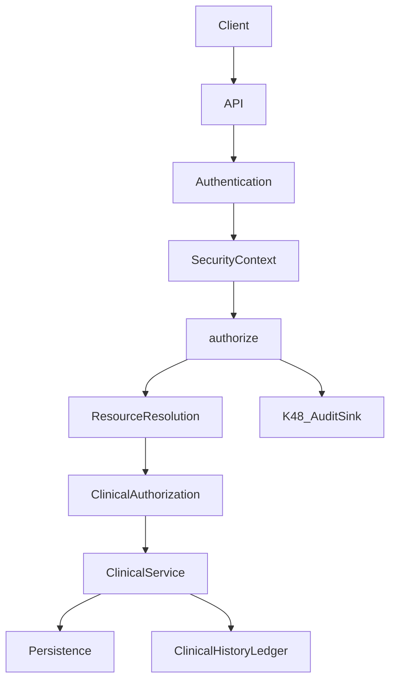

# KROK 53 — Veterinary Clinical Workflow Audit

**Datum:** 2026-09-12  
**Typ:** POUZE ARCHITEKTONICKÝ AUDIT — žádný aplikační kód, žádné API, žádná DB, žádné nové modely, žádné UI.  
**Navazuje na:** [K37 household (assert)](../scripts/assert-pet-household-access.mts), [K47](K47-security-authorization-runtime.md), [K48](K48-security-audit-trail-runtime.md), [K49](K49-veterinary-health-workflow-audit.md), [K50](K50-health-authorization-hardening.md), [K51](K51-clinical-record-integrity.md), [K52](K52-clinical-server-history-architecture-audit.md)

**Cíl:** Prokázat, zda veterinární část LOVED & KNOWN je připravená jako dlouhodobě důvěryhodný klinický workflow systém (majitelé, domácnosti, veterináři, kliniky, organizace), nikoli pouze jako formulář pro očkování a návštěvy.

**Poznámka k číslování:** K52 §28 doporučoval „K53 = server clinical vertical“. Tento dokument **přebírá** label K53 dle product briefu (veterinary clinical workflow audit). Server vertical a další kroky jsou přečíslovány v §32 K54+.

---

## Absolutní zákazy (K53)

K53 **neimplementuje** a **nemění**:

- aplikační kód (`src/**`)
- nové modely / storage / routes / UI
- permissions / authorization / SecurityContext / AuditEvent
- HealthRecord / PetDocument / WeightMeasurement
- Booking / Payment / Organization / access grants
- Messages / Emergency / Lost & Found / membership / onboarding

Výstup je **pouze** tento dokument. GAP = budoucí kontrakt, ne implementace.

---

## 1. Executive Summary

### Verdikt (shrnutí)

**B — HEALTH ARCHITECTURE NEEDS HARDENING FIRST**

Po K50 (`clinicalGate`), K51 (provenance + soft withdraw) a K52 (server history design) je **klinická doménová architektura konzistentní** a vhodná jako základ produkce. Není důvod k redesignu Pet/Health/Access/Security stacku (**ne C**). Systém ale **není ready** pro produkční multi-clinic klinický provoz (**ne A**): authority je DEMO/localStorage, chybí Clinical Encounter, clinical history ledger (`version`), jemnější clinical authority (finalize/sign), a několik workflow kroků je PLACEHOLDER / MISSING.

### Co už je robustní (kontrakt + DEMO runtime)

| Oblast | Evidence |
|--------|----------|
| Pet = SSOT identity | `Pet.id`, `ownerAccountId` |
| Oddělené access domains | Household ≠ Professional ≠ OrganizationPetAccess |
| Role ≠ Permission | HH/Pro/Org stored permissions; role jen defaults |
| Booking ≠ health | `adapters/booking.ts` explicit isolation DENY |
| Payment ≠ health | `adapters/payment.ts` isolation |
| Messaging ≠ clinical DB | `adapters/messaging.ts` DENY health.*; `HealthShareMenu` DEMO placeholder |
| Microchip ≠ authorization | Non-owner DENY `microchip.read` in adapters |
| Clinical gate | `clinicalGate` → `authorize()` deny-by-default |
| Provenance stamps | `createdBy*`, `updatedBy*`, `recordSource` (metadata only) |
| Soft withdraw | HealthRecord / PetDocument `lifecycleStatus` |
| Public ≠ clinical | Privacy forbidden keys; emergency card opt-in text only |
| Org AND gate | Membership alone ≠ pet health |
| Server history design | K52 document (not implemented) |

### Co je pouze DEMO

- Veškerá persistence klinických dat: `localStorage` + IndexedDB blobs
- `SecurityContext.authority = 'demo'`
- Session / ownership soft flags
- K48 demo AuditSink (wipeable LS)
- Messages health-share UI
- Payment / Stripe Connect scaffolding
- Microchip verification `dev_mock` mode

### Co je připravené jako serverový kontrakt

- Typy a permission vocabularies (HH / Pro / Org)
- Central `authorize()` + adapters
- Clinical provenance field shapes (K51)
- K52 persistence / version / history / migration design
- Projection boundaries (omit denied fields)

### Kritické gap (P0)

1. **localStorage = klientská autorita** — forge ownership/grants/records v DevTools  
2. **Žádný Clinical Encounter** — Booking a HealthRecord nejsou spojeny klinickým návštěvním rámcem  
3. **Žádný `version` / clinical history ledger** — edit přepisuje in-place; K48 ≠ clinical history  
4. **`health.write` ≠ clinical authority** — chybí finalize/sign/admin-edit/withdraw/export nuance  
5. **Server `authority:'server'` neexistuje** — K52 design only  

### Nebezpečné převést do produkce bez hardeningu

- Jakýkoli trust client-claimed `actorAccountId`, grants, timestamps, ownership  
- Automatický grant health z booking / org membership / microchip / emergency  
- Hard delete klinické historie  
- Share „celého Pet object“ přes Messages  
- Per-clinic kopie zdravotní karty místo Pet-scoped SSOT  

---

## 2. Current Architecture

```
Session (DEMO)
  → SecurityContext(authority='demo')
  → clinicalGate → authorize() + domain adapters
  → Pet ownership | PetHouseholdAccess | PetProfessionalAccess | OrganizationPetAccess
  → stamp (clinicalProvenance) → mutate AppContext / localStorage
  → project* (HH / Pro / Org) — after ALLOW only
  → K48 AuditSink (authorization_decision only)
```

### Clinical SSOT (zachovat)

| Model | Role | DEMO storage |
|-------|------|--------------|
| `HealthRecord` | Polymorphic clinical facts (`vaccination` / `vet` / `medication` / `examination` / `assessment`) | `lovedandknown.healthRecords` |
| `PetDocument` | Document metadata + blob | meta LS + IndexedDB |
| `WeightMeasurement` | Weight history (separate) | `lovedandknown.weightMeasurements` |

### Access / security SSOT (zachovat — žádný paralelní systém)

| Domain | Storage key (DEMO) |
|--------|-------------------|
| Ownership | `Pet.ownerAccountId` on `lovedandknown.pets` |
| Household | `lovedandknown.petHouseholdAccess` |
| Professional | `lovedandknown.petProfessionalAccess` |
| Organization | `lovedandknown.organizations` + memberships + `organizationPetAccess` |
| Booking | `lovedandknown.bookings` (isolated) |
| Authz audit | `lovedandknown.securityAuthorizationAudit` |

### Co NENÍ v runtime

- `ClinicalEncounter` / visit closure  
- Integer `version` / append-only clinical history  
- Live API / DB / `authority: 'server'`  
- Clinical finalize/sign actions  
- Weight `lifecycleStatus` / withdraw  

---

## 3. Current Veterinary Workflow

Legenda: **EXISTUJE** · **ČÁSTEČNĚ EXISTUJE** · **PLACEHOLDER** · **MISSING** · **DEMO ONLY** · **SERVER REQUIRED**

| Krok | Stav | Poznámka |
|------|------|----------|
| Booking create / confirm / decline / cancel / reschedule / no-show / complete | **EXISTUJE** + **DEMO ONLY** + **SERVER REQUIRED** | `Booking` + statuses; client LS |
| Příchod na kliniku | **MISSING** | Žádný check-in / arrival event |
| Identifikace Pet | **ČÁSTEČNĚ EXISTUJE** | `petId` na booking; microchip owner-private; QR emergency ≠ clinical ID workflow |
| Ověření oprávnění | **EXISTUJE** + **DEMO ONLY** | `authorize()` / `clinicalGate`; LS grants |
| Otevření zdravotní karty | **EXISTUJE** + **DEMO ONLY** | Pro/Org/HH projections after grant |
| Vyšetření | **ČÁSTEČNĚ EXISTUJE** | `HealthRecord.type` `vet` / `examination` / `assessment` — flat records, ne encounter |
| Klinický zápis | **EXISTUJE** + **DEMO ONLY** | CRUD přes AppContext + gate |
| Diagnostika | **PLACEHOLDER** / **MISSING** | Žádný first-class diagnosis; lab ≈ document / examination |
| Léčba | **ČÁSTEČNĚ EXISTUJE** | `medication` type + reminders; ne prescribe/administer workflow |
| Dokumentace (RTG, lab PDF…) | **EXISTUJE** + **DEMO ONLY** | `PetDocument` + IDB |
| Léky (prescribed vs home) | **ČÁSTEČNĚ EXISTUJE** | Polymorphic fields; source nuance slabá |
| Očkování | **EXISTUJE** + **DEMO ONLY** | `vaccination` + `nextDueDate` |
| Doporučení / follow-up | **ČÁSTEČNĚ EXISTUJE** | Notes / calendar / nextDue; ne formal care plan |
| Platba | **EXISTUJE** + **DEMO ONLY** + izolace od health | `Payment`; ≠ clinical |
| Uzavření návštěvy | **MISSING** | Booking `completed` ≠ clinical finalize |
| Follow-up / další návštěva | **ČÁSTEČNĚ EXISTUJE** | Booking + calendar; ne linked encounter chain |
| Dlouhodobá historie | **ČÁSTEČNĚ EXISTUJE** + **SERVER REQUIRED** | Pet-scoped records exist; no version ledger; LS not durable authority |

**Závěr workflow:** Administrativní booking vrstva a flat clinical records existují. Chybí **klinický encounter lifecycle** mezi nimi.

---

## 4. Pet Identity

### Současné identifikátory

| Identifikátor | Role | Authorization? |
|---------------|------|----------------|
| `Pet.id` (`petId`) | Canonical SSOT | Ano — resource key pro grants |
| `Pet.ownerAccountId` | Ownership | Ownership path; ≠ automatic pro/org access |
| `microchip` (+ verification) | Physical identity attribute | **NE** — `microchip.read` owner-only DENY for non-owners |
| Public slug / Discover | Public social projection | **NE** — clinical forbidden |
| Emergency QR / found token | Finder / acute card | **NE** — limited publicView; ≠ health grant |
| Booking.`petId` | Administrative link | **NE** — booking adapter isolates health |
| PetProfessionalAccess / OrganizationPetAccess | Explicit grants | Ano — po status effective + permissions |

### Budoucí bezpečný princip (kontrakt)

```
identity verification (who is this Pet? microchip / docs / owner attest)
  → authentication (who is this actor?)
  → authorization (authorize() + grants)
  → clinical access (projection / mutation)
```

**Invariant:** Znám číslo microchipu → **nemám** přístup ke zdravotní kartě.

### Edge cases (audit)

| Scénář | Současný stav | GAP |
|--------|---------------|-----|
| Změna majitele | Ownership helpers exist; no formal transfer ledger | Transfer + revoke prior grants contract |
| Nalezený Pet | Lost & Found / found QR | Link-back to owner without clinical escalation |
| Neznámý majitel (ER) | Emergency card opt-in text | Limited emergency write + later link (K62) |
| Duplicita Pet | Client-only; no merge | Server identity resolution |
| Chybná identita | Soft data | Correction + audit + immutable prior |
| Více ID (chip + passport) | Fields on Pet / docs | Multi-identifier index under Pet SSOT |
| Oprava identity | Manual edit | Server-controlled correction workflow |

---

## 5. Booking → Clinical Encounter

### Explicitní hranice

**Booking ≠ Clinical Record.**

Booking **smí** obsahovat: Pet, termín, službu, profesionála, status, administrativní poznámku.

Booking **nesmí** automaticky znamenat: health access, health write, clinical authority, celou zdravotní historii.

### Evidence

```text
src/lib/security/adapters/booking.ts
  — DENY health.*, medication.*, vaccination.*, labs.*, documents.*, microchip.read, ownerContacts.read
  — reason: "Booking access does not grant health or sensitive pet data"
```

### Booking lifecycle (DEMO)

| Akce | Stav |
|------|------|
| create | EXISTUJE |
| confirm | EXISTUJE (pro) |
| decline | EXISTUJE (status) |
| cancel | EXISTUJE |
| reschedule | ČÁSTEČNĚ (policy/slots; client) |
| no-show | EXISTUJE (status) |
| complete | EXISTUJE (status) — **ne** clinical close |
| booking bez access grantu | ALLOW booking side; health stále DENY bez grantu |
| booking jinou osobou | Owner/pro scoped; HH booking nuance limited |
| práce bez rezervace | Možná přes Pro/Org grant + HealthRecord; **bez Encounter** |

### Budoucí kontrakt (neimplementovat)

```
Booking (admin)
  ⟂ optional link
ClinicalEncounter (clinical visit frame)
  → contains / references HealthRecord, PetDocument, measurements
  → finalize/sign separate from booking.completed
```

Žádný booking nesmí auto-grantovat `OrganizationPetAccess` ani `PetProfessionalAccess`.

---

## 6. Clinical Records

### Runtime fields (K51)

Na `HealthRecord` / `PetDocument` (weight částečně):

| Field | Health | Docs | Weight |
|-------|--------|------|--------|
| createdAt / updatedAt | ano | uploadedAt / updatedAt | ano |
| createdBy* / updatedBy* | ano | uploadedBy* / updatedBy* | ano |
| recordSource | ano (metadata) | ano | ano |
| lifecycleStatus / withdraw* | ano | ano | **MISSING** |
| version | **MISSING** (K52 design) | MISSING | MISSING |
| optimistic locking | MISSING | MISSING | MISSING |
| server timestamps | DEMO client `Date` | DEMO | DEMO |

### IMMUTABLE / EDITABLE / WITHDRAWABLE (kontrakt)

| Třída | Obsah |
|-------|--------|
| **IMMUTABLE** | Původní autor (`createdByAccountId`), původní čas (`createdAt`), historické verze clinical fact, withdraw stamps |
| **EDITABLE** | Klinický obsah aktivního záznamu (title, notes, med fields…); `updatedAt` / `updatedByAccountId` |
| **WITHDRAWABLE** | Chybný / duplicitní záznam → soft withdraw; row retained |

Hard delete klinických dat = **rizikový**; DEMO už preferuje soft withdraw pro Health/Docs. Weight stále bez withdraw (**GAP**).

`recordSource` = metadata only — **nikdy** authz bypass (komentář v `types/index.ts` + `clinicalProvenance.ts`).

---

## 7. Clinical Authorship

### Scénář: Vet A vytvoří, Vet B upraví

**Dnes (DEMO):**

- Create stamp: `createdByAccountId`, `createdAt`, `recordSource`
- Update stamp: `updatedByAccountId`, `updatedAt`; immutable keys stripped from client Partial
- **In-place overwrite** — předchozí clinical content **není** v ledgeru
- K48 loguje ALLOW/DENY authorize, **ne** clinical diff

**Produkční kontrakt (K52 + tento audit — neimplementovat):**

| Otázka | Odpověď kontraktu |
|--------|-------------------|
| Kdo vytvořil? | `createdByAccountId` (server-controlled, immutable) |
| Kdo změnil? | `updatedByAccountId` + history row `changedByAccountId` |
| Kdy vznikl / změněn? | Server clock |
| Předchozí / nová verze | Integer `version` + append-only clinical history |
| Důvod změny | `changeReason` / `changeKind: correction \| clinical_update \| administrative` |
| Org kontext | `organizationId` na history entry (K52) |

Authorship ≠ Membership ≠ Pet Access.

---

## 8. Owner / Household

### K37 rozhodnutí (potvrzeno v kódu)

| Role | Health |
|------|--------|
| Owner (`Pet.ownerAccountId`) | Plný přístup (ownership path) |
| Co-owner | Defaults: `health_read` + `health_write` (+ docs…) |
| Caregiver | Default: `health_read`; **ne** `health_write` unless explicit |
| Viewer | Bez health / docs |

Role ≠ permission: `suggestedHouseholdPermissionsForRole` jen defaults; stored `permissions[]` je SSOT.

### Audit otázky

| Otázka | Odpověď |
|--------|----------|
| Může caregiver sdílet klinická data? | Ne formal share path; Messages health-share DEMO; bez export permission vocabulary |
| Může caregiver vytvořit klinický záznam? | Pouze s explicit `health_write` (ne default) |
| Může co-owner upravit veterinární záznam? | Ano v DEMO pet-scoped edit policy (K51) — **GAP** vs future clinical finalize |
| Může owner odebrat veterináři access? | Ano — revoke Pro/Org grant |
| Historie po revoke? | Records zůstávají na Pet; projection DENY; authorship zachován |
| Bypass přes klienta? | **Ano v DEMO** — LS forge; production musí server-enforce |

---

## 9. Professional Access

### Invarianty (potvrzeno)

- Professional role / `ProfessionalProfile.type` ≠ automatic Pet access  
- Pet access ≠ automatic health write — granular `ProfessionalPermission` (`viewHealth`, `addVisit`, …)  
- Microchip / owner contacts **nikdy** v Pro permissions  

### Lifecycle

`pending` → `active` → `revoked` / `expired` (+ request/grant/approve/cancel helpers)

### Projection

`projectPetForProfessional` — split records by permission; withdrawn filtered; no microchip.

### Bypass checklist

| Vector | Current protection | Production |
|--------|-------------------|------------|
| Booking | Isolation DENY | Server same |
| Organization | Separate OrgPetAccess + AND membership | Server same |
| Messages | DENY health | Server same |
| Public profile | No clinical | Server same |
| Emergency | Opt-in text ≠ grant | Limited ER contract |
| Microchip | DENY read non-owner | Server same |
| URL petId | Gate on action | Server resolve + authz |
| localStorage | **None (DEMO)** | Irrelevant as authority |
| Forged IDs / payload | Honest DEMO policy | Ignore client claims |

---

## 10. Organization / Clinic

### Oddělení vrstev

```
OrganizationMembership  ≠  OrganizationPetAccess  ≠  Clinical Permission  ≠  Clinical Authorship
```

- Org roles: `owner` | `admin` | `professional` | `staff` | `viewer`  
- Org ops permissions ≠ pet health  
- Org→Pet: `OrganizationPetAccess` + `visibilityMode` (`assigned_only` | `role_eligible`)  
- Adapter: **AND gate** membership + effective grant + permission  

### Scénář kliniky

| Actor | Booking | Health read/write | Authorship |
|-------|---------|-------------------|------------|
| Reception | Admin booking (future role map) | Ne automatic | Ne |
| Tech | Pokud grant + perms | Selected writes if permitted | Stamped if writes |
| Vet A / B | — | Pokud grant + perms | `createdBy` / `updatedBy` |
| Admin | Membership mgmt | Ne automatic | Ne |

### Employee lifecycle

| Event | Expected |
|-------|----------|
| Leave / remove / suspend | Membership inactive → org pet path DENY even if grant exists for others |
| Role change | Re-evaluate eligibility / assigned lists |
| Org change | New org needs new grants |
| Former employee | No access via old membership |
| Staff + Pet never granted | DENY |

**DEMO risk:** LS edit membership/grants. **Production:** server grant store + membership status.

---

## 11. Future Clinical Roles

Neimplementovat nové role. Architektura **umožní** mapování na existující vrstvy:

| Future role | Booking | Health | Notes |
|-------------|---------|--------|-------|
| Receptionist | Org staff + booking actions | No auto health | Map to `staff` + no OrgPet health perms |
| Veterinary technician | Limited write (vitals/prep) | Explicit perms | May need finer actions later (K55) — map, don't fork permission system |
| Veterinarian | Clinical write / finalize | Explicit | Finalize = future action |
| Clinic admin | Membership / settings | No auto pet clinical | `admin` + org ops |
| Specialist | Pro or Org grant on Pet | Explicit | Same access domains |
| Organization staff | Ops | No auto | Existing |

**Invariant:** Role nesmí grantovat více Pet access než potřeba; Pet access zůstává explicit grant.

---

## 12. Permissions

### Současná vocabulary (zachovat)

| Domain | Examples |
|--------|----------|
| SecurityAction | `health.read/write`, `vaccination.*`, `medication.*`, `labs.*`, `documents.*` |
| Household | `health_read`, `health_write`, … |
| Professional / OrgPet | `viewHealth`, `addVisit`, `addVaccination`, … |

### GAP: clinical authority nuance

Současný systém **nemá** oddělené:

- access vs read vs write  
- administrative edit  
- clinical write  
- clinical finalize/sign  
- withdraw  
- audit (view)  
- export/share  

Dnes: coarse `health.write` (+ type-mapped vaccination/medication/labs/documents).  

**K55** = audit mapování jemnější authority na **existující** systém (bez nového paralelního Permission frameworku).

---

## 13. Documents

### Vztah

| Entity | Role |
|--------|------|
| `PetDocument` | Binary + metadata attachment |
| `HealthRecord` | Clinical fact |
| `AuditEvent` | Authorization decision (K48) — **≠** document history |

### Typické přílohy (budoucí content classes)

Lab results, RTG, ultrasound, photos, discharge, vaccination certificates — dnes category/type strings + blob; ne typed clinical subclasses.

### Authz / lifecycle

| Capability | DEMO |
|------------|------|
| Upload | Gate `documents.write` + stamp |
| Read | Gate + projection |
| Metadata edit | Update path + immutable upload stamps |
| Withdraw | Soft withdraw |
| Export | **GAP** — no formal export permission |
| Authorship | `uploadedByAccountId` / `updatedByAccountId` |
| History | In-place; no version ledger |
| Public | Forced `isPublic: false` |

---

## 14. Medication

### Současné

- `HealthRecord.type === 'medication'` + dosage / schedule / reminderDays  
- Reminders: `src/lib/medicationReminders.ts`  
- Authz: `medication.read/write`

### GAP pro produkční clinic workflow

| Need | Status |
|------|--------|
| Prescribe vs administer vs home med | **GAP** — flat record |
| Dose change / stop | Partial via update; no structured status machine |
| Historical medication | Active list filters; no ledger |
| Allergies / contraindications | Emergency card text / notes — **not** clinical SSOT structured |
| Owner-entered vs clinical | `recordSource` metadata only |

Pokud HealthRecord nestačí na structured Rx: **rozšířit typ/fields**, ne nový paralelní Medication systém — nebo sub-type contract v K60.

---

## 15. Vaccination

### Současné

- Polymorphic `vaccination` with `vaccineName`, `nextDueDate`, status  
- Distinct from other types via `type` discriminator — **bezpečně rozlišitelné**  
- Authz: `vaccination.write`  
- Projections: separate `vaccinations` arrays  

### GAP

Clinic / applicator identity = free-text `doctor` / `clinic` (not org FK); document link optional; no formal validity registry; no versioned certificate chain.

Polymorphic HealthRecord **stačí** jako SSOT discriminator; production needs stronger provenance + optional linked `PetDocument`.

---

## 16. Measurements

### WeightMeasurement

| Aspect | Status |
|--------|--------|
| Author / timestamps / recordSource | K51 stamps |
| Units | Implicit (number); formal units **GAP** |
| History | Separate store + seed merge |
| Correction | In-place update |
| Withdrawal | **MISSING** |

### Kritické

**Hodnota zadaná majitelem ≠ automaticky klinicky naměřená hodnota.**

Dnes: `recordSource` může naznačit path, ale není `measurementAuthority: owner_reported | clinic_measured`. **K59** kontrakt.

---

## 17. Clinical Sharing

### DEMO

- `HealthShareMenu.tsx` — explicit DEMO placeholder; **nečte** AppContext SSOT  
- `authorizeMessaging` DENY any `health.*`  
- Legacy `buildHealthShareMessage` not wired as production path  

### Budoucí princip

```
Professional requests data
  → Owner/authorized actor approves
  → server authorization
  → explicit clinical projection (field-minimized)
  → only permitted data
```

**Nesmí:** share entire Pet object. **Messages ≠ clinical database.** Share grants must be separate time-boxed projections, not permanent health write.

---

## 18. Emergency

### Surfaces

| Surface | Content | Clinical SSOT? |
|---------|---------|----------------|
| Emergency Card publicView | Opt-in acute text (allergies, meds…) | **Ne** — parallel by design |
| Lost & Found | Public announcement / finder | **Ne** |
| QR / found token | Contact path | **Ne** |

### ER scénář: zraněný Pet bez ověřeného majitele

| Action | Policy (kontrakt) |
|--------|-------------------|
| Zobrazit | Only emergency projection / finder-safe fields |
| Zapsat | Future limited emergency clinical write under audit — **not implemented** |
| Bez owner approval | Minimal life-saving fields only; no full history |
| Audit | Authz + clinical audit |
| Later link to owner | Attach encounter to Pet after identity proof |
| Prevent escalation | Emergency ≠ full clinical access; no auto Pro/Org grant |

**NEIMPLEMENTOVAT** emergency bypass v K53.

---

## 19. Audit Trail

### Dvě různé věci

| | K48 Authorization Audit | Future Clinical Audit Trail |
|--|-------------------------|------------------------------|
| Otázka | ALLOW/DENY? | Who created/changed/withdrew/exported clinical data? |
| Event | `AuditEvent` `authorization_decision` | Clinical history / clinical audit entries (K52) |
| Payload | Scrubbed; no health body | Versions / diffs / reasons (still minimize PII) |

**K48 AuditEvent nepřepisovat.** Nesloučit clinical history do AuditSink.

### Clinical audit must track (kontrakt)

actor, organization, Pet, resource, action, timestamp, previous version, new version, reason, authorization decision id/correlation, source.

---

## 20. SecurityContext / authorize

### Pipeline (zachovat)

```
Client
  → API (future)
  → Authentication
  → SecurityContext (authority: demo|server)
  → authorize()
  → resource resolution
  → clinicalGate / clinical authorization
  → clinical service
  → persistence
  → AuditSink (K48) + clinical history (future, separate)
```

### DEMO vs PRODUCTION

| | DEMO | PRODUCTION |
|--|------|------------|
| authority | `'demo'` | `'server'` |
| Session | `createDemoSecurityContext` / soft session | Server token |
| Grants | localStorage loaders | Server grant store |
| Timestamps | Client Date | Server clock |
| Client actor claims | Ignored inside honest adapter; store still forgeable | Ignored + store not client-writable |

**localStorage ≠ production authority.**  
**Client-side gate ≠ production security boundary** (honest DEMO contract only).

---

## 21. Threat Model

| # | Threat | Impact | Current protection | Production protection | Priority |
|---|--------|--------|--------------------|----------------------|----------|
| 1 | localStorage manipulation | Full ACL/data forge | None (DEMO) | Server authority; LS cache only | P0 |
| 2 | Forged actorAccountId | Impersonation attempt | Demo session adapter prefers self | Server session | P0 |
| 3 | Forged professionalId | Wrong pro access | Grant match checks (honest) | Server grants | P0 |
| 4 | Forged organizationId | Cross-org attempt | Context + AND gate | Server membership | P0 |
| 5 | Pet ID in URL changed | Cross-pet read/write attempt | authorize on petId | Server resolve + authz | P0 |
| 6 | Direct helper invocation | Bypass UI | If helper skips gate = risk; K50 gated paths | Only service API | P0 |
| 7 | Modified permission payload | Escalate perms | Stored grant is SSOT in DEMO (editable) | Server immutable grants | P0 |
| 8 | Revoked access reuse | Stale access | Status checks in policy | Server status + token revoke | P0 |
| 9 | Expired access reuse | Stale access | Expiry checks | Server clock | P0 |
| 10 | Employee after leaving clinic | Former staff access | Membership status in adapter (LS forgeable) | Server membership | P0 |
| 11 | Booking → health escalation | Privilege escalation | Explicit isolation | Same + tests | P0 |
| 12 | Org membership → health escalation | Privilege escalation | AND grant required | Same | P0 |
| 13 | Emergency → full record | Over-disclosure | Projection limited | ER contract + audit | P1 |
| 14 | Microchip → health access | Privilege escalation | DENY microchip as authz | Same | P0 |
| 15 | Public projection → clinical leak | Privacy breach | Forbidden keys / projectors | Server projections | P0 |
| 16 | Cross-pet access | Wrong patient | petId on grants | Server | P0 |
| 17 | Cross-organization access | Wrong clinic | orgId + grant | Server | P0 |
| 18 | Viewer → writer escalation | Unauthorized write | Permission lists | Server | P0 |
| 19 | Caregiver → owner escalation | Unauthorized manage | Role≠owner; perms explicit | Server | P1 |
| 20 | Manipulated clinical history | Integrity loss | Soft stamps; no ledger; LS editable | version + history + server | P0 |

---

## 22. Data Classification

| Class | Examples | Projection / access |
|-------|----------|---------------------|
| **PUBLIC** | Discover name/photo (visibility), public pro profile | Public projectors only; no clinical |
| **OWNER / HOUSEHOLD** | Profile, gallery, calendar per HH perms | HH grant + ownership |
| **CLINICAL** | HealthRecord, meds, vax, exams | health.* after authorize |
| **CLINICAL_HIGH_RISK** | Full history, labs, controlled meds, psych notes (future) | Narrower perms + audit |
| **ORGANIZATION_INTERNAL** | Membership, staffing, clinic settings | Org ops perms; ≠ pet clinical |
| **SECURITY / AUDIT** | AuditEvent, authz decisions | Restricted ops; scrubbed |
| **SECRET** | Session tokens, payment secrets, raw microchip (treat as sensitive), owner contacts | Owner-only / never in public/pro default |

---

## 23. Server Authority

| AREA | DEMO AUTHORITY | PRODUCTION AUTHORITY | CLIENT TRUSTED? | SERVER REQUIRED? | RISK |
|------|----------------|----------------------|-----------------|------------------|------|
| ownership | LS Pet.ownerAccountId | Server Pet row | No | Yes | P0 forge owner |
| household | LS grants | Server grants | No | Yes | P0 |
| professional | LS grants | Server grants | No | Yes | P0 |
| organization | LS membership + grants | Server | No | Yes | P0 |
| health read | clinicalGate + LS | Server authorize + project | No | Yes | P0 |
| health write | clinicalGate + stamps | Server mutate | No | Yes | P0 |
| clinical write | Same as health write | + authority nuance | No | Yes | P0 |
| clinical finalize | MISSING | Server action | No | Yes | P1 |
| document upload | LS + IDB | Object storage + authz | No | Yes | P0 |
| document access | Projection | Signed URL / gated | No | Yes | P0 |
| withdrawal | Soft in LS | Server withdraw + history | No | Yes | P0 |
| emergency | PublicView client | Server projection | No | Yes | P1 |
| microchip | Owner field LS | Server; never authz key | No | Yes | P0 |
| audit | LS demo sink | Durable sink | No | Yes | P0 |
| booking | LS | Server bookings | No | Yes | P1 (iso health P0) |
| payment | DEMO provider | PSP + server | No | Yes | P0 secrets |
| export/share | Placeholder | Server projection grant | No | Yes | P1 |

**Explicit:** localStorage ≠ production authority. Client-side gate ≠ production security boundary.

---

## 24. Multi-clinic Architecture

### Požadavek

Jeden Pet → Klinika A → B → Specialista C → Pohotovost D:

- **JEDNA historie pod Pet**  
- Access **explicit** per actor / organization / grant / permission  
- **Žádné** kopie zdravotní karty per klinika  

### Současná architektura

| Aspect | Status |
|--------|--------|
| Pet-scoped HealthRecord / Docs / Weight | **ANO** — supports longitudinal SSOT |
| Per-clinic grant isolation | **ANO** via separate OrgPetAccess / Pro access |
| Per-clinic card copy model | **NE** — good (must not introduce) |
| Encounter attribution to clinic | **GAP** — free-text `clinic` / future orgId on encounter |
| Cross-clinic read without grant | DENY (policy); LS bypass DEMO |

**Verdikt:** Doménový model **umožňuje** multi-clinic longitudinal record. Chybí Encounter + server grants + history ledger pro důvěryhodný provoz.

---

## 25. External Integrations

| Concern | Kontrakt |
|---------|----------|
| Interní SSOT | Pet + HealthRecord + PetDocument + Weight (+ future Encounter) |
| External source | EMR / lab / imaging / registry payloads as **imports** with provenance |
| `recordSource` / `externalSystemId` | Metadata; never authz |
| Sync | Pull/push jobs; conflict policy (server wins / clinician resolve) |
| Source authority | Explicit ranking; clinician acknowledgment for clinical adoption |
| Withdraw | Soft withdraw imported facts; don't silently delete audit |
| Provenance | Preserve external id + import actor + timestamps |

Nic neintegrovat v K53.

---

## 26. Clinical Timeline

### Budoucí obsah timeline

| Include | Exclude |
|---------|---------|
| HealthRecord events | Raw K48 AuditEvent stream |
| PetDocument issued/attached | Authorization deny noise |
| Weight measurements (tagged source) | Payment events as clinical |
| ClinicalEncounter open/close | Booking alone as clinical fact (link as admin context) |
| Vaccination / medication milestones | Public social posts |

**KRITICKÉ:** AuditEvent ≠ Clinical Timeline. Authorization audit ≠ Clinical History.

---

## 27. Data Lifecycle

```
create → read → update → withdraw → archive → retention → regulated deletion policy
```

| Rule | Guidance |
|------|----------|
| Historicky dohledatelné | Authorship, versions, withdraw, key exports |
| Withdraw | Soft; retain row + stamps |
| Anonymize | Legal review; possible for some PII after retention |
| Hard delete | Explicit production policy only; default avoid for clinical |
| Immutable history | Version ledger (K52/K57) |

Retention policy **neimplementovat** v K53 (legal review K63).

---

## 28. Demo → Production Migration

### Must preserve

- Pet identity (`petId`)  
- Ownership  
- Authorship (`createdBy*`)  
- Provenance / lifecycle  
- Versions (once present) / history  
- Access grants (as-is; validate)  
- Authz audit where possible  

### Must not

- Change owner silently  
- Change author  
- Auto-add access / health permission  
- Auto-create clinical records  
- Lose history  

### Process (K52 aligned)

1. Export DEMO stores with checksums  
2. Server validate referential integrity  
3. Re-stamp server-controlled fields where DEMO untrusted  
4. Import grants only if structurally valid — **no widening**  
5. Cutover: `authority: 'server'`  

---

## 29. Risk Matrix

| AREA | CURRENT STATE | GAP | RISK | PRIORITY | PRODUCTION REQUIREMENT |
|------|---------------|-----|------|----------|------------------------|
| Server authority | DEMO LS | No server runtime | Total forge | P0 | K56 vertical |
| Clinical Encounter | Missing | Booking≠visit frame | Workflow / authz confusion | P0 | K54 audit → later impl |
| Version / history | In-place edit | No ledger | Silent overwrite | P0 | K57 |
| Clinical authority nuance | Coarse write | No finalize/sign | Over-broad edits | P1 | K55 audit → map actions |
| Weight lifecycle | No withdraw | Parity gap | Bad measurements linger | P1 | K59 |
| Medication workflow | Flat type | Rx/admin/home | Clinical safety | P1 | K60 |
| Clinical share | Placeholder | No server share | Leak / fake share UX | P1 | K61 |
| Emergency clinical write | Card text only | ER write path | Unsafe improvisation | P1 | K62 |
| Document blob authz | IDB local | No gated download | Leak if server naively | P1 | K58 |
| Idempotency / offline | None | Double writes | Integrity | P2 | K63 |
| GDPR retention | Undefined | Legal | Compliance | P2 | K63 + legal |
| Multi-clinic SSOT | Pet-scoped OK | Encounter org link | Attribution | P1 | Encounter + orgId |
| External EMR | None | Integration contract | Dual SSOT risk | P2 | §25 contract first |

---

## 30. Gaps

### P0

1. Client/localStorage as authority  
2. No Clinical Encounter boundary object  
3. No clinical version/history ledger  
4. No production server authorize→persist path  
5. Threat class: privilege escalation via forged grants (DEMO)

### P1

1. health.write too coarse for clinic roles  
2. Weight withdraw + clinic vs owner measurement authority  
3. Medication/vaccination clinic-grade workflow  
4. Server-gated document download  
5. Clinical sharing beyond Messages placeholder  
6. Emergency limited clinical write contract  
7. Multi-clinic encounter attribution  

### P2

1. Idempotency / offline intent queue  
2. GDPR retention/erasure runbooks  
3. External EMR/lab sync  
4. Formal units / measurement types beyond weight  
5. Diagnosis/surgery as first-class HealthRecordType extensions  

---

## 31. Recommended Architecture

### Zachovat

- Pet SSOT  
- HealthRecord + PetDocument + WeightMeasurement  
- HH / Pro / OrgPet access domains  
- K47 SecurityContext + authorize()  
- K48 AuditEvent (authz only)  
- K50 clinicalGate  
- K51 provenance + soft withdraw  
- K52 server history design direction  
- Booking/Payment isolation  

### Přidat později (ne v K53)

- ClinicalEncounter (link optional to Booking)  
- `version` + clinical history store  
- Server authority runtime  
- Finer clinical actions mapped onto existing permission systems  
- MeasurementAuthority / weight withdraw  
- Explicit clinical share grants  

### Nikdy

- Paralelní PetAccess / Permission / Authorization / Audit / Messaging systémy  
- Microchip jako authz  
- Booking/membership auto health grant  
- Per-clinic copied health cards  
- Messages as clinical DB  
- Public clinical payloads  



---

## 32. K54+

| Step | Typ | Proč | Závislosti | Nesmí |
|------|-----|------|------------|-------|
| **K54** | Audit | Clinical Encounter architecture; Booking→Encounter boundary | K53, K49 | Implementace encounter; merge booking+health |
| **K55** | Audit | Clinical authority vocabulary mapped on existing actions/perms | K54, K50 | Nový paralelní permission systém |
| **K56** | Implementation / vertical | Server authority for clinical mutations (K52 bývalé „K53“) | K47–K52, K55 decisions | Fake LS backend; new access model |
| **K57** | Implementation / contract | Integer `version` + clinical history append + withdraw/restore | K52, K56 | Merge history into K48 AuditSink |
| **K58** | Implementation | Document object storage + download authz | K56 | Bytes inside clinical JSON unauthenticated |
| **K59** | Audit→impl | Weight/measurement owner vs clinic source + lifecycle parity | K51, K56 | New measurement SSOT fork |
| **K60** | Audit→impl | Medication/vaccination clinical workflow contract | HealthRecord types | Parallel Medication DB |
| **K61** | Implementation | Clinical sharing (replace Messages placeholder) | K50, K56 | Share entire Pet; Messages as DB |
| **K62** | Audit→impl | Emergency veterinary limited-write + audit | Emergency card, K56 | Emergency→full clinical escalation |
| **K63** | Audit / runbooks | Idempotency + offline intent; GDPR retention | K52, legal | Client-trusted offline commit; legal conclusions in code |

Pokud je nejistota v Encounter vs authority vocabulary: **K54 a K55 zůstávají audity před implementací** (doporučeno).

---

## 33. Explicit Decisions

1. Pet = SSOT identity Pet.  
2. Ownership ≠ Access.  
3. Role ≠ Permission.  
4. Membership ≠ Pet Access.  
5. Organization Membership ≠ Clinical Access.  
6. Professional Access ≠ Health Write.  
7. Booking ≠ Clinical Record.  
8. Payment ≠ Clinical Record.  
9. AuditEvent ≠ Clinical History.  
10. Emergency Access ≠ Full Clinical Access.  
11. Microchip ≠ Authorization.  
12. Public Projection ≠ Clinical Projection.  
13. localStorage ≠ production authority.  
14. Client-side gate ≠ production security boundary.  
15. Messages ≠ clinical database.  
16. Clinical history must not be silently overwritten (ledger required for production).  
17. Historical authorship must not be overwritten on edit (`createdBy*` immutable).  
18. Hard delete of clinical history = explicit production policy only.  
19. No actor gains access by forging client payload (production).  
20. No booking auto-grants clinical access.  
21. No organization membership auto-grants Pet clinical access.  
22. No microchip lookup auto-grants clinical access.  
23. No public profile may contain clinical data.  
24. No new parallel PetAccess / Permission / Authorization / Audit / Messaging systems.  
25. K53 číslování = veterinary workflow audit; K52 „K53 server vertical“ → **K56**.  
26. Final verdict = **B**.

---

## 34. Final Verdict

### **B — HEALTH ARCHITECTURE NEEDS HARDENING FIRST**

**Proč ne A (READY):**  
DEMO authority, chybějící Encounter, chybějící version/history ledger, coarse clinical write, no server persistence — produkční multi-clinic provoz by byl nebezpečný.

**Proč ne C (REDESIGN REQUIRED):**  
Pet SSOT, oddělené access domains, booking/payment/messaging izolace, clinicalGate, provenance, soft withdraw a K52 server design jsou správně napojené na klinickou doménu. Hardening a server vertical **nad** existující architekturou — ne rewrite.

**Vztah k K50/K51/K52:**  
Tyto vrstvy jsou správný směr a jsou konzistentní s celým workflow auditem; **nejsou** ještě kompletní produkční klinický workflow (encounter + server + history + authority nuance).

---

## Appendix A — Key evidence paths

| Topic | Path |
|-------|------|
| HealthRecord / Weight / Docs types | `src/types/index.ts` |
| clinicalGate | `src/lib/security/clinicalGate.ts` |
| authorize | `src/lib/security/authorize.ts` |
| Booking isolation | `src/lib/security/adapters/booking.ts` |
| Provenance | `src/lib/health/clinicalProvenance.ts` |
| HH defaults | `src/lib/household/permissions.ts` |
| Pro access types | `src/types/professional.ts` |
| Org pet access | `src/types/organization.ts`, `adapters/organizationPet.ts` |
| Messages share DEMO | `src/components/messages/HealthShareMenu.tsx` |
| Emergency publicView | `src/lib/emergencyCard/publicView.ts` |
| Booking statuses | `src/lib/booking/types.ts` |
| Prior audits | `docs/K49-*.md` … `docs/K52-*.md` |

## Appendix B — Explicit NOT implemented (K53)

K53 **neimplementovalo**: žádný aplikační kód, žádné nové modely, storage, routes, UI, permissions, authorization, Health/Booking/Access/Security/Audit změny, žádnou klinickou integraci, žádný emergency bypass, žádný paralelní security systém.

**Jediný deliverable:** `docs/K53-veterinary-clinical-workflow-audit.md`
