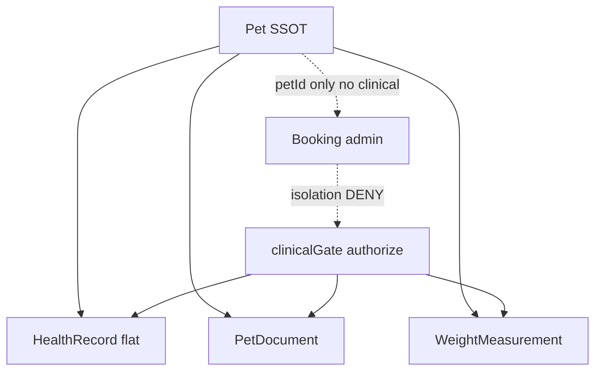
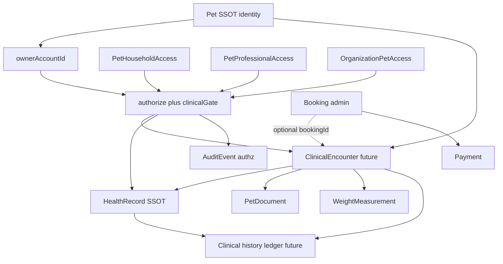

# KROK 54 — Clinical Encounter Architecture Audit

**Datum:** 2026-09-12  
**Typ:** POUZE ARCHITEKTONICKÝ AUDIT + DESIGN — žádný aplikační kód, žádné API, žádná DB, žádné nové modely, žádné UI.  
**Navazuje na:** [K47](K47-security-authorization-runtime.md), [K48](K48-security-audit-trail-runtime.md), [K49](K49-veterinary-health-workflow-audit.md), [K50](K50-health-authorization-hardening.md), [K51](K51-clinical-record-integrity.md), [K52](K52-clinical-server-history-architecture-audit.md), [K53](K53-veterinary-clinical-workflow-audit.md)

**Cíl:** Definovat budoucí model **Clinical Encounter** jako klinickou epizodu péče o Pet, oddělenou od Booking a od HealthRecord, při zachování Pet = jeden longitudinal clinical record napříč klinikami a poskytovateli.

---

## Absolutní zákazy (K54)

K54 **neimplementuje** a **nemění**:

- aplikační kód (`src/**`)
- nové modely / storage / routes / UI
- HealthRecord / PetDocument / WeightMeasurement
- Booking / Payment / Messages / Emergency / Lost & Found
- PetProfessionalAccess / PetHouseholdAccess / OrganizationPetAccess / Organization
- SecurityContext / `authorize()` / AuditEvent
- membership / onboarding / permissions vocabulary v runtime

Výstup je **pouze** tento dokument. GAP = budoucí kontrakt, ne implementace.

---

## 1. Executive Summary

### Verdikt

**B — CLINICAL ENCOUNTER DESIGN NEEDS FURTHER HARDENING**

Po K50 (`clinicalGate`), K51 (provenance + soft withdraw), K52 (server history design) a K53 (veterinary workflow audit) je **základní klinická a bezpečnostní architektura konzistentní**. Není důvod k redesignu Pet / Health / Access / Security stacku (**ne C**).

Systém ale **není ready** pro implementaci produkčního Clinical Encounter (**ne A**):

1. Runtime **nemá** entitu Encounter — Booking a HealthRecord nejsou spojeny klinickým návštěvním rámcem.
2. Authority je DEMO / `localStorage` — klient není production security boundary.
3. Chybí clinical finalize / sign a jemnější clinical authority (K55).
4. Chybí integer `version` + clinical history ledger (K52/K57).
5. Flat polymorphic HealthRecord umí fakta, ale ne epizodu péče.

### Co je robustní (zachovat)

| Oblast | Evidence |
|--------|----------|
| Pet = SSOT identity | `Pet.id`, `ownerAccountId` |
| Clinical SSOT triad | HealthRecord + PetDocument + WeightMeasurement |
| Access domains oddělené | Household ≠ Professional ≠ OrganizationPetAccess |
| Role ≠ Permission | Stored permissions; role jen defaults |
| Booking ≠ health | `adapters/booking.ts` isolation DENY |
| Payment / Messaging izolace | adapters DENY health.* |
| clinicalGate → authorize() | deny-by-default |
| K51 provenance | `createdBy*`, `updatedBy*`, `recordSource`, soft withdraw |
| Org AND gate | Membership ≠ pet health |
| Public ≠ clinical | Privacy forbidden keys |
| Owner / Co-owner health | Owner full; co_owner defaults health_read + health_write |

### Kritické gap (P0) specifické pro Encounter

1. **Žádný ClinicalEncounter** v runtime  
2. **Booking.complete ≠ clinical episode** — no-show / cancel / walk-in / ER nerozlišitelné klinicky  
3. **localStorage = klientská autorita**  
4. **Žádný version / history ledger** — silent overwrite  
5. **health.write příliš hrubé** pro finalize / sign / admin correction  

### Jednověté shrnutí

Encounter musí být budoucí **kontejner klinické epizody** nad Pet-scoped HealthRecord SSOT — ne druhý health systém, ne ownership grant, ne automatický důsledek Booking.

---

## 2. Current Architecture

```
Session (DEMO)
  → SecurityContext(authority='demo')
  → clinicalGate → authorize() + domain adapters
  → Pet ownership | PetHouseholdAccess | PetProfessionalAccess | OrganizationPetAccess
  → stamp (clinicalProvenance) → mutate AppContext / localStorage
  → project* (HH / Pro / Org) — after ALLOW only
  → K48 AuditSink (authorization_decision only)
```

### Clinical SSOT (runtime — zachovat)

| Model | Role | DEMO storage | Encounter link? |
|-------|------|--------------|-----------------|
| `HealthRecord` | Polymorphic clinical facts | `lovedandknown.healthRecords` | **NONE** |
| `PetDocument` | Document metadata + blob | LS meta + IndexedDB | **NONE** (petId only) |
| `WeightMeasurement` | Weight history | `lovedandknown.weightMeasurements` | **NONE** |

### HealthRecord types (runtime)

`vaccination` | `vet` | `medication` | `examination` | `assessment`

UI „návštěva veterináře“ = `type === 'vet'` — **flat record**, ne encounter container.

### Access / security SSOT (zachovat — žádný paralelní systém)

| Domain | DEMO key |
|--------|----------|
| Ownership | `Pet.ownerAccountId` |
| Household | `lovedandknown.petHouseholdAccess` |
| Professional | `lovedandknown.petProfessionalAccess` |
| Organization | orgs + memberships + `organizationPetAccess` |
| Booking | `lovedandknown.bookings` (isolated) |
| Authz audit | K48 demo sink |

### Co NENÍ v runtime

- `ClinicalEncounter` / `encounterId`
- Integer `version` na clinical models
- Clinical finalize / sign actions
- Booking ↔ HealthRecord FK
- Weight `lifecycleStatus` / withdraw
- Live API / DB / `authority: 'server'`



---

## 3. Clinical Encounter Definition

### Definice

**Clinical Encounter** = konkrétní klinická epizoda péče o konkrétního **Pet** u konkrétního poskytovatele péče (veterinář / klinika / specialista / pohotovost), v čase ohraničená začátkem a ukončením (nebo withdraw), obsahující nula nebo více klinických faktů.

### Příklady epizod

- preventivní prohlídka  
- očkování  
- akutní návštěva  
- chirurgický zákrok  
- kontrola po zákroku  
- dermatologie / stomatologie  
- pohotovost  
- hospitalizační epizoda  
- specialistické vyšetření  

### Oddělení (audit současného modelu)

| Entita | Současný stav | Oddělitelná? |
|--------|---------------|--------------|
| **Pet** | SSOT identity | Ano — existuje |
| **Booking** | Admin slot / lifecycle | Ano — existuje, izolováno |
| **Clinical Encounter** | **MISSING** | GAP — nutný budoucí objekt |
| **HealthRecord** | Flat clinical fact | Ano — existuje; není kontejner epizody |

### Invariant

```
ONE PET = ONE LONGITUDINAL CLINICAL RECORD
  → many Encounters over years
  → each Encounter → zero or more HealthRecords / Documents / Measurements
```

**Nesmí** vzniknout samostatná zdravotní karta per klinika.

---

## 4. Booking vs Encounter

### P0 hranice

**Booking ≠ Clinical Encounter.**  
**Booking.completed ≠ clinical finalized.**  
**Booking.cancel NESMÍ smazat klinická data.**

Booking smí nést: Pet, termín, službu, profesionála, status, admin poznámku.  
Booking **nesmí** auto-grantovat: health access, clinical write, OrganizationPetAccess, PetProfessionalAccess, ownership.

Evidence: `src/lib/security/adapters/booking.ts` — DENY health.*, medication.*, vaccination.*, labs.*, documents.*, microchip.read, ownerContacts.read.  
`src/lib/booking/privacy.ts` — forbids health keys on booking payloads.  
`completeBooking` only sets status + `completedAt` — **no** HealthRecord create.

### Scénáře A–I

| ID | Scénář | Booking | Encounter | Budoucí kontrakt |
|----|--------|---------|-----------|------------------|
| **A** | Booking existuje → Pet přijde → Encounter | `confirmed` → later `completed` | Vytvoří oprávněný clinician | Optional `bookingId` link |
| **B** | Booking → no-show | `no_show` | **Žádný** Encounter | Booking status remains; no clinical episode |
| **C** | Walk-in bez Booking | žádný / irrelevant | Encounter bez `bookingId` | ALLOW if clinical authz |
| **D** | Emergency bez Booking | žádný | Encounter `encounterType=emergency` | Emergency authz ≠ permanent grant |
| **E** | Admin vytvoření Encounter | optional | Clinician/admin clinical path | `clinical.write` future; not booking.create |
| **F** | Booking člověk A, Encounter veterinář B | A = booker | B = author if B authorized | Authz on B grants, not booking actor |
| **G** | Booking zrušen, návštěva přesto proběhla | `cancelled_*` | Encounter může existovat | Cancel ≠ delete clinical; link may remain historical |
| **H** | Jeden Booking → více úkonů | jeden Booking | **jeden** Encounter | Multiple HealthRecords inside Encounter |
| **I** | Jedna návštěva → více HealthRecord | n/a | jeden Encounter | Explicitly supported |

### Hranice (locked)

- Maximálně **1:1** Booking → Encounter (ne 1 Booking → N Encounters jako default).  
- N úkonů = N HealthRecords (a dokumenty/měření) **uvnitř** jednoho Encounter.  
- Encounter **může** existovat bez Booking.  
- Booking **může** existovat bez Encounter (no-show, cancel without visit).

---

## 5. Encounter Lifecycle

### Navržené stavy (budoucí)

Rozdělení na **klinické** vs **administrativní / UI**:

| Status | Třída | Nutný? | Význam |
|--------|-------|--------|--------|
| `scheduled` | Admin/UI | Ano (light) | Plánovaná epizoda; často zrcadlí Booking; **ještě ne klinická péče** |
| `checked_in` | Admin/UI | Ano (light) | Pet na místě; stále před klinickým zápisem |
| `in_progress` | **Klinický** | **Ano** | Aktivní klinická práce; draft records allowed |
| `completed` | **Klinický** | **Ano** | Klinická práce skončila; ještě nemusí být finalized/signed |
| `finalized` | **Klinický** | **Ano** | Klinicky uzavřeno; no silent overwrite |
| `cancelled` | Admin | Ano | Epizoda zrušena **před** klinickými fakty; nebo admin cancel bez péče |
| `no_show` | Admin | Ano | Odpovídá Booking no-show; **žádné** clinical records expected |
| `withdrawn` | **Klinický** | Ano (rare) | Epizoda stažena (legal/clinical); history retained |
| `planned` | UI only | Ne jako SSOT | Mapovat na `scheduled` |
| `emergency` | **Ne status** | — | `encounterType` / `source`, ne lifecycle state |

### Kdo smí měnit stavy (budoucí — mapovat v K55)

| Přechod | Typická autorita | Reversibilní? | Klinická data |
|---------|------------------|---------------|---------------|
| → `scheduled` / `checked_in` | clinical.write nebo booking-adjacent staff s clinical admin | Ano | Žádná / draft |
| → `in_progress` | clinical.write | Omezeně | Draft records |
| → `completed` | clinical.write | Omezeně před finalize | Records existují |
| → `finalized` | clinical.finalize (+ optional clinical.sign) | **Ne** silent reverse | Locked; addendum/correction only |
| → `cancelled` / `no_show` | admin / booking path | Ano dokud žádná clinical fakta | Pokud records existují → cancel nestačí, potřeba withdraw policy |
| → `withdrawn` | clinical.withdraw | Soft; history kept | Encounter + children soft-withdrawn |

### Kritické pravidlo

**Booking cancellation NESMÍ automaticky mazat ani withdrawovat klinické záznamy.**  
Pokud Encounter již má HealthRecords, cancel Booking pouze uvolní slot; klinická historie zůstává.

---

## 6. Encounter vs HealthRecord

### Vztah

```
Encounter
  → HealthRecord[]     (clinical facts SSOT)
  → PetDocument[]      (attachments; optional encounterId)
  → WeightMeasurement[] (optional encounterId)
```

### Co Encounter NEDUPLIKUJE

Encounter **není** druhý HealthRecord systém. Neduplikuje:

- diagnózu (budoucí fact type / notes on HealthRecord)  
- medikaci  
- očkování  
- váhu  
- dokumenty  

Ty zůstávají na existujících modelech (rozšířených o optional `encounterId` — **budoucí** FK, neimplementovat zde).

### Co Encounter nese

- epizoda (kdy, kdo, kde/org, typ, status)  
- authorship epizody (created/finalized)  
- optional link na Booking  
- provenance epizody (`source`)  
- `version` epizody (K52 contract)

### HealthRecord zůstává klinickým SSOT existujících dat

**NEVYTVÁŘET** nový paralelní HealthRecord model.

---

## 7. Clinical Authorship

### K51 runtime (zachovat)

Na HealthRecord / PetDocument:

- `createdByAccountId`, `updatedByAccountId`
- `createdAt`, `updatedAt`
- `recordSource` (`owner` | `co_owner` | `caregiver` | `professional` | `organization`)
- `lifecycleStatus` (`active` | `withdrawn`)
- **Chybí runtime `version`** (K52 design only)

Weight: authorship + `recordSource`; **bez** lifecycle withdraw.

### Scénář A / B / C

| Actor | Akce | Budoucí dohledatelnost |
|-------|------|------------------------|
| Veterinář A | otevře Encounter | Encounter.createdBy = A |
| Veterinář B | pokračuje zápis | HealthRecord.createdBy/updatedBy = B; Encounter.updatedBy = B |
| Veterinář C | admin oprava | clinical.admin / correction path; history row; reason required |

Systém musí umět zjistit: kdo vytvořil Encounter, kdo vytvořil record, kdo změnil, kdy, previous/new version, důvod.

**K51 se nepřepisuje** — rozšiřuje se o Encounter stamps + K52 version/history.

`recordSource` = metadata only — **nikdy** authz bypass.

---

## 8. Owner / Co-owner

### Absolutní rozhodnutí (NEMĚNIT)

| Role | Health access |
|------|---------------|
| **OWNER** | Plný přístup ke zdravotním údajům |
| **CO-OWNER** | Plný health.read + health.write; stejný přístup k existující klinické historii jako owner; **nesmí** odebrat původního ownera z ownership modelu |
| **CAREGIVER** | Pouze explicitní permissions (default health_read, ne health_write) |
| **VIEWER** | Žádný health access |

Poznámka: runtime household role je `caregiver` (ne „caretaker“). Owner není household role — je `Pet.ownerAccountId`.

### Propis do Encounter

- Owner / Co-owner smí číst všechny Encounters Pet (v rámci své health autorizace).  
- Owner / Co-owner smí vytvářet owner-entered records (home meds, owner weight) — `recordSource` owner/co_owner; tyto mohou být **mimo** clinic Encounter nebo v „owner care“ epizodě.  
- Owner / Co-owner **nevytváří** clinic Encounter jménem kliniky (org/professional attribution).  
- Co-owner nemůže přes Encounter měnit ownership.

---

## 9. Household

| Role | Encounter read | Encounter write (clinic) | Notes |
|------|----------------|--------------------------|-------|
| Owner | Ano (full health) | Owner-entered only / not clinic finalize | Ownership path |
| Co-owner | Ano (full health) | Stejně jako owner pro home records | Defaults health_write |
| Caregiver | Jen s `health_read` | Jen s explicit `health_write` | Žádný auto clinic finalize |
| Viewer | Ne | Ne | — |

Household access ≠ Professional access ≠ OrganizationPetAccess.

Encounter **nevytváří** Household grant.

---

## 10. Professional Access

```
ProfessionalProfile (identity)
  ≠ clinical access
PetProfessionalAccess (explicit grant + permissions)
  → authorize(health.*)
  → Clinical Encounter read/write
```

**Professional role / profile type NESMÍ** znamenat „vidí všechny Encountery všech Pet“.

Musí existovat: **explicit access + authorization + appropriate permission**.

Pro permissions dnes: `viewHealth`, `viewVaccinations`, `viewMedications`, `viewDocuments`, `addVisit`, `addVaccination`, `addHealthRecord`, `addNote`.

Budoucí Encounter create/finalize mapovat na tyto (nebo extended SecurityActions) v **K55** — bez nového paralelního permission systému.

`addVisit` dnes **nevytváří** Encounter entitu — UI/grant label only.

---

## 11. Organization / Clinic

### Scénář: Klinika A (vet A, vet B, technik, recepce, admin) + OrganizationPetAccess na Pet

| Actor | Create Encounter | Read | Write clinical | Finalize/Sign | Booking only |
|-------|------------------|------|----------------|---------------|--------------|
| Vet A/B (eligible + grant + write perms) | Ano | Ano (granted projection) | Ano | Ano pokud clinical.finalize | Ano |
| Technik | Jen pokud explicit write/vitals perms | Pokud read | Limited (K55 map) | Ne default | Možná |
| Recepce | Ne default | Ne default clinical | Ne | Ne | Ano (booking) |
| Org admin (membership) | **Ne** jen z membership | **Ne** jen z membership | Ne | Ne | Org ops ≠ pet |

### Kritické

**OrganizationMembership ≠ Clinical Authorization.**  
Evidence: org AND gate — membership ∧ OrganizationPetAccess ∧ eligibility ∧ permission.

### Revoke / role change / employee leave

| Událost | Efekt |
|---------|-------|
| Odchod zaměstnance (membership removed/suspended) | Nový access DENY; historické Encounter authorship zůstává (account id stamps) |
| Změna role | Eligibility se přepočítá; bez eligible role → DENY pet clinical |
| Revoke OrganizationPetAccess | Nový read/write DENY; Encounter history na Pet zůstává; projekce kliniky končí |

Encounter **nevytváří** OrganizationPetAccess.

---

## 12. Multi-clinic

### Scénář (10 let života Pet)

| Rok | Poskytovatel | Encounter |
|-----|--------------|-----------|
| 1 | Klinika A | Encounter A |
| 4 | Klinika B | Encounter B |
| 7 | Specialista C | Encounter C |
| 8 | Pohotovost D | Encounter D |
| 9 | Klinika A znovu | Encounter E |

Všechny v **jedné** Pet longitudinal historii.

### Access pravidla

- Klinika B **automaticky nezíská** přístup k Encounterům kliniky A.  
- Pokud má B explicit grant na relevantní clinical history (`viewHealth` atd.), server vrátí **povolenou projekci** (ne nutně full raw).  
- Attribution: `organizationId` / `professionalId` na Encounter = **provenance**, ne grant.  
- Free-text `HealthRecord.clinic` dnes ≠ authorization (GAP: strukturované org link na Encounter).

### Verdikt multi-clinic

Doménový model Pet-scoped SSOT **umožňuje** multi-clinic longitudinal record.  
Chybí Encounter + server grants + history ledger + projection nuance pro důvěryhodný provoz.

---

## 13. Clinical Permissions

### Současné SecurityActions (health)

`health.read` | `health.write` | `medication.read/write` | `vaccination.read/write` | `labs.read/write` | `documents.read/write`

Mapování v `clinicalGate.writeActionForHealthRecordType`:

| HealthRecordType | Write action |
|------------------|--------------|
| vaccination | `vaccination.write` |
| medication | `medication.write` |
| examination | `labs.write` |
| vet / assessment / default | `health.write` |

### Budoucí nuance (design only — K55)

| Action | Účel |
|--------|------|
| `health.read` | Čtení clinical projection |
| `health.write` / typed writes | Draft / active clinical facts |
| `clinical.write` | Encounter open/update + draft notes (může aliasovat health.write zpočátku) |
| `clinical.finalize` | Uzavření epizody |
| `clinical.sign` | Profesionální podpis (kde legally required) |
| `clinical.admin` | Admin correction / metadata bez clinical content rewrite |
| `clinical.withdraw` | Soft withdraw encounter/record |
| `clinical.export` | Export balíčku |

### Partial access scénáře

| Actor má | Actor nemá | Důsledek |
|----------|------------|----------|
| health.read | health.write | Read Encounters + records; no mutate |
| health.write | clinical.finalize | Draft/complete; cannot finalize |
| documents.read | clinical.write | Docs only; no encounter note |
| vaccination.write | medication.write | Typed isolation already partially exists |

### Architektura dovoluje jemnější future authorization?

**Ano** — rozšířením `SecurityAction` + mapováním na existující HH/Pro/Org permission lists uvnitř stávajícího `authorize()`.  
**Ne** vytvářet paralelní permission framework.

Draft clinical note vs finalized clinical record = lifecycle + action split, ne nový model.

---

## 14. Emergency

### Současný stav

- `Pet.emergencyCard` + `publicView` — opt-in acute **text**, masked chip optional.  
- **Nikdy** HealthRecord arrays / owner PII na public finder.  
- Emergency permissions HH: `emergency_read` / `emergency_write` — **≠** `health.read` / `health.write` auto.  
- Žádný emergency → Clinical Encounter path v runtime.

### Budoucí hranice

```
emergency authorization (time-bounded, audited)
  → emergency Encounter (encounterType=emergency, source=emergency)
  → limited clinical.write
  → K48 + clinical history audit
  → optional later owner/professional linking
```

**emergency access ≠ permanent full health access.**  
Po skončení emergency okna: revoke emergency capability; historický Encounter zůstává na Pet; další access jen přes normální grants.

**NEIMPLEMENTOVAT** emergency bypass v K54.

---

## 15. Documents

### Současný stav

`PetDocument`: petId-scoped; categories include health (`vaccination_record`, `lab_results`, `vet_report`); K51 provenance + soft withdraw; blobs IndexedDB; `isPublic` forced false on write.  
**Žádný** `encounterId` / `healthRecordId` FK.

### Budoucí Encounter → Documents

| Concern | Kontrakt |
|---------|----------|
| Vazba | Optional `encounterId` na existující PetDocument |
| Author | `uploadedByAccountId` / `updatedByAccountId` (K51) |
| Source | `recordSource` |
| Version | K52 integer `version` |
| Access | documents.read/write via authorize + projection |
| Withdrawal | soft `lifecycleStatus=withdrawn` |
| Export | clinical.export + allowlisted projection |

Příklady: RTG, ultrazvuk, lab zpráva, propouštěcí zpráva, operační protokol.

**NEVYTVÁŘET** nový Document model.

---

## 16. Measurements

### Současný stav

`WeightMeasurement`: petId, date, weight, note, authorship, `recordSource`.  
Gate: `health.write` na create.  
**Žádný** encounter link; **žádný** lifecycle withdraw; **žádný** explicit `measurementAuthority`.

### Provenance gap

`recordSource` rozlišuje actor path (owner / co_owner / caregiver / professional / organization), ale **ne** explicitně:

- owner-entered weight vs  
- clinic-measured weight  

### Budoucí kontrakt

- Optional `encounterId`  
- Zachovat `recordSource`; zvážit metadata `measuredInClinic: boolean` nebo enum **bez** nového paralelního measurement systému  
- Soft withdraw / version per K52  
- Owner vs clinic musí zůstat dohledatelné

**NEVYTVÁŘET** nový measurement model.

---

## 17. Medication

### Současný stav

`HealthRecord.type === 'medication'` — dosage, schedule, reminders; write = `medication.write`.  
Projekce: `view.medications`.  
Žádný encounter attachment.

### Budoucí

```
Encounter → medication HealthRecord(s)
  → follow-up medication change = new record or versioned update (K52)
```

Rozlišit via `recordSource` (+ budoucí import source):

| Source | Význam |
|--------|--------|
| owner / co_owner | Home-reported |
| caregiver | Explicit HH write |
| professional / organization | Clinician-entered |
| imported / external | Future EMR import (K25 external) |

**NEIMPLEMENTOVAT** nový Medication model.

---

## 18. Vaccination

### Současný stav

`HealthRecord.type === 'vaccination'` — vaccineName, nextDueDate, clinic/doctor free text; write = `vaccination.write`.

### Budoucí

```
Encounter → vaccination record(s)
```

Stejná provenance pravidla jako medication.  
Encounter typu „vaccination visit“ může obsahovat vaccination + weight + document (certifikát).

**NEIMPLEMENTOVAT** nový Vaccination model.

---

## 19. Clinical Timeline

### Budoucí vrstvy

| Timeline | Obsah | Není |
|----------|-------|------|
| **Pet Timeline** | Sociální / lifecycle události Pet (UX) | Clinical SSOT |
| **Clinical Timeline** | Ordered Encounters + attached clinical facts | Authorization audit list |
| **Encounter** | Epizoda | — |
| **HealthRecord** | Fakt uvnitř / mimo Encounter | — |
| **AuditEvent (K48)** | Authorization decisions | Clinical history |

### Kritické

**AuditEvent NESMÍ být používán jako klinická historie.**  
**Clinical Timeline NESMÍ být pouze seznam Authorization AuditEvent.**

Clinical history = Encounter + HealthRecord (+ docs/measurements) + K52 clinical history ledger.  
K48 zůstává security authz trail.

---

## 20. Audit Trail

### K48 současný AuditEvent

Zachytává: actor, org, resource, action, allow/deny, grant, correlation, authority.  
**Nezachytává:** clinical mutation success, previous/new clinical version, clinical reason, encounter id as first-class (unless stuffed in scrubbed metadata — not designed for it).

### Budoucí klinická auditní historie (GAP — rozšíření, ne přepis K48)

Musí umět:

| Field | Poznámka |
|-------|----------|
| actor | Account |
| organization | Optional facet |
| Pet | petId |
| encounter | encounterId |
| record | healthRecordId / documentId / measurementId |
| action | create/update/finalize/sign/withdraw/export |
| timestamp | Server clock |
| previous version / new version | K52 |
| reason | Required for admin correction / withdraw |
| authorization decision | Link/correlation to K48 event |

**K48 nepřepisovat.** Pokud nestačí → append-only **clinical history** store (K52) + optional correlationId na K48.

---

## 21. SecurityContext

### Současný tvar (K47)

`correlationId`, `requestId`, `channel`, `authentication`, `actor`, `organization?`, `professional?`, `activeMode?`, `authority: 'demo' | 'server'`

DEMO: `createDemoSecurityContext` — claimed actor discarded; session self only.

### Napojení Encounter (budoucí)

- Encounter mutations vyžadují autentizovaný SecurityContext.  
- `authority: 'server'` povinné v produkci.  
- Org/pro facets informují path; **grant** rozhoduje.  
- Žádný Encounter payload nesmí forgeovat actor/org/professional identity.

**NEMĚNIT** SecurityContext v K54.

---

## 22. Threat Model

| # | THREAT | IMPACT | CURRENT PROTECTION | PRODUCTION REQUIREMENT | PRIORITY |
|---|--------|--------|--------------------|------------------------|----------|
| 1 | forged petId | Cross-pet clinical access | authorize on petId (honest DEMO) | Server resolve + authz every call | P0 |
| 2 | forged encounterId | Cross-encounter / cross-pet | N/A (no entity) | Encounter.petId bind + authz | P0 |
| 3 | forged actorAccountId | Impersonation | Demo adapter discards claim | Server session identity | P0 |
| 4 | forged professionalId | Wrong pro access | Profile bind to account | Server bind + grant match | P0 |
| 5 | forged organizationId | Cross-org | Context + AND gate | Server membership | P0 |
| 6 | forged permission payload | Privilege escalation | LS grants editable | Server-immutable grants | P0 |
| 7 | revoked professional access | Stale clinical access | Status checks (LS) | Server status + revoke | P0 |
| 8 | revoked organization access | Stale clinic access | AND gate (LS) | Server revoke | P0 |
| 9 | caregiver privilege escalation | Unauthorized write | Default no health_write | Server enforce stored perms | P0 |
| 10 | viewer privilege escalation | Unauthorized health | No health defaults | Server deny | P0 |
| 11 | booking → encounter escalation | Health via booking | Booking isolation DENY | Same + Encounter requires clinical authz | P0 |
| 12 | emergency → permanent access | Full health leak | Emergency ≠ health grant | Time-bound emergency authz | P0 |
| 13 | microchip → clinical access | Authz via chip | microchip.read owner-only | Never use chip as authz | P0 |
| 14 | public profile → clinical leak | Privacy breach | Forbidden keys / projectors | Server projections | P0 |
| 15 | direct localStorage manipulation | Full forge ACL/data | None (DEMO) | LS cache only; server SSOT | P0 |
| 16 | cross-clinic encounter access | Clinic B sees A | No Encounter; grants pet-scoped | Encounter org attribution + grant-scoped projection | P0 |
| 17 | cross-pet encounter access | Wrong patient | petId on records | Encounter.petId immutable + check | P0 |
| 18 | old URL replay | Stale deep link access | Soft client checks | Server authz each request + token expiry | P0 |
| 19 | stale authorization | Act after revoke | Status/expiry in adapters | Server re-authz; short-lived tokens | P0 |
| 20 | manipulated clinical version | Silent history rewrite | Soft stamps; no ledger; LS | Integer version + history + server | P0 |

---

## 23. Data Classification

| Class | Examples | Public? | Notes |
|-------|----------|---------|-------|
| **Public social** | Discover name/photo/bio | Ano (projected) | Never clinical |
| **Owner PII / contacts** | phone, email, address | Ne | ownerContacts.read owner-only |
| **Identity attribute** | microchip | Ne (except masked emergency opt-in) | ≠ authz |
| **Administrative booking** | slot, service, status | Parties only | ≠ clinical |
| **Clinical facts** | HealthRecord, meds, vax | Granted only | Pet longitudinal |
| **Clinical documents** | lab PDF, imaging | documents.* | Soft withdraw |
| **Measurements** | weight | health.* | Provenance required |
| **Encounter metadata** | type, status, org attribution | Granted clinical readers | Not ownership |
| **Emergency acute text** | allergies string | Opt-in publicView | ≠ HealthRecord |
| **Authz audit** | K48 events | Internal | ≠ clinical timeline |
| **Payment** | amounts, status | Financial parties | ≠ health |

---

## 24. Server Authority

| ACTION | DEMO AUTHORITY | PRODUCTION AUTHORITY | CLIENT TRUSTED? | SERVER REQUIRED? | RISK |
|--------|----------------|----------------------|-----------------|------------------|------|
| create encounter | N/A (missing) | Server + clinical.write | No | Yes | P0 invent client-side |
| read encounter | N/A | Server authorize + project | No | Yes | P0 leak |
| update encounter | N/A | Server + version | No | Yes | P0 overwrite |
| finalize encounter | N/A | clinical.finalize | No | Yes | P0 fake finalize |
| sign encounter | N/A | clinical.sign | No | Yes | P0 forged signature |
| withdraw record | Soft LS K51 | Server withdraw + history | No | Yes | P0 hard delete |
| add document | LS + IDB | Object storage + authz | No | Yes | P0 |
| read document | Projection / blob URL | Signed URL / gated | No | Yes | P0 |
| add measurement | LS + health.write | Server + provenance | No | Yes | P0 |
| add vaccination | LS + vaccination.write | Server + version + idempotency | No | Yes | P0 duplicate |
| add medication | LS + medication.write | Server + version + idempotency | No | Yes | P0 |
| export clinical data | N/A | clinical.export + audit | No | Yes | P0 over-export |
| emergency clinical write | N/A | Time-bound emergency authz | No | Yes | P0 permanent escalate |

**KRITICKÉ:** `localStorage` nikdy nesmí být production authority.

---

## 25. Data Consistency

### Současný stav

- In-place overwrite HealthRecord (no version)  
- Soft withdraw Health/Docs  
- Weight upsert by id  
- Concurrent tabs = last-write-wins LS  
- Žádné optimistic locking  
- Žádné server transactions  

### K52 zohlednění (budoucí)

| Problem | Kontrakt |
|---------|----------|
| concurrent edits | Integer `version` + `If-Match` / expected version |
| version conflict | HTTP 409 `stale_version` |
| stale UI | Reject; client refetch |
| duplicate encounter | Idempotency-Key on create |
| duplicate record | Idempotency-Key + natural keys where safe |
| retry / network failure | Idempotent replay |
| partial save | Single transaction boundary |

### Budoucí transaction boundaries

```
1. authenticate → build SecurityContext (server)
2. authorize(action, pet/encounter/record)
3. load current row + version
4. validate transition / payload
5. mutate Encounter and/or clinical facts
6. append clinical history ledger
7. emit K48 authz audit (already in authorize) + clinical mutation audit correlation
8. commit
```

**NEIMPLEMENTOVAT** v K54.

---

## 26. Idempotency

### Požadavky

Veterinář klikne „Uložit“ → request odejde dvakrát → **nesmí** vzniknout dva identické klinické záznamy.

Stejně pro: vaccination, medication, document, encounter completion, finalization.

### Budoucí server-side contract

| Operation | Idempotency |
|-----------|-------------|
| POST create Encounter | `Idempotency-Key` required; store TTL |
| POST create HealthRecord | Key required |
| PATCH update | Key recommended; also guarded by `version` |
| finalize / sign | Key required; second call returns same finalized state |
| withdraw | Key + version; already withdrawn → stable response |
| document upload | Key + checksum |

Server stores idempotency records with TTL.  
**NEIMPLEMENTOVÁNO** — design only (K52 + this doc).

---

## 27. External Systems

### Budoucí napojení (žádná integrace v K54)

EMR, laboratoře, imaging, registry, specialist systems.

| Concern | Kontrakt |
|---------|----------|
| source | External system id + system type |
| import | Into Pet longitudinal SSOT as HealthRecord/Doc/Measurement (± Encounter) |
| provenance | `recordSource` + external source metadata |
| conflict | Version/history; never silent clobber newer internal |
| authority | Server validates; external ≠ auto full access |
| version | K52 |
| withdrawal | Soft withdraw imported facts if superseded/erroneous |

Interní Pet clinical history zůstává konzistentní SSOT.  
External feed **nevytváří** per-clinic parallel card.

---

## 28. Projections

### Budoucí projection vrstvy

| Layer | Clinical? |
|-------|-----------|
| Public | **Nikdy** clinical SSOT |
| Owner | Full health (authorized) |
| Household | Per stored permissions |
| Professional | Per PetProfessionalAccess permissions |
| Organization | Per OPA + eligibility |
| Clinical | Encounter-aware clinical view for authorized clinicians |
| Emergency | Opt-in acute text / time-bound emergency encounter slice |

### Zakázané

- project entire Pet  
- public → clinical  
- booking → full clinical record  
- microchip → clinical record  

Projection ≠ authorization. Always authorize first, then project allowlist.

---

## 29. Retention

### Architektonický kontrakt (ne policy implementace)

```
create → update (versioned) → finalize → withdraw → archive → retention
```

| Data | Historicky dohledatelné? |
|------|--------------------------|
| Finalized Encounter metadata | Ano |
| Clinical history ledger versions | Ano (legal window) |
| Withdrawn records | Ano soft; hidden from default clinical UI |
| Hard delete | **Zakázán** pro clinical facts v běžném provozu |
| Authz audit (K48) | Separate retention |
| Booking admin | Independent of clinical retention |

Legal retention windows = **LEGAL REVIEW** (out of scope for code).  
Architecture must not hard-overwrite without history.

---

## 30. Future Encounter Model

### Konceptuální model (NE TypeScript)

```
ClinicalEncounter
- id
- petId                          # required; immutable; SSOT bind
- bookingId?                     # optional admin link; NOT authz
- organizationId?                # attribution; NOT grant
- professionalId?                # attribution; NOT grant
- encounterType                  # preventive|acute|surgery|specialty|emergency|hospital|follow_up|other
- status                         # scheduled|checked_in|in_progress|completed|finalized|cancelled|no_show|withdrawn
- startedAt?
- endedAt?
- createdAt
- createdByAccountId
- updatedAt?
- updatedByAccountId?
- finalizedAt?
- finalizedByAccountId?
- source                         # booking|walk_in|emergency|admin|import
- version                        # integer optimistic lock
```

### Attachment (budoucí FK na existující modely)

```
HealthRecord.encounterId?
PetDocument.encounterId?
WeightMeasurement.encounterId?
```

### Proč tato pole

| Field | Důvod |
|-------|-------|
| petId | Longitudinal bind |
| bookingId? | Scenarios A/F/G without merging domains |
| organizationId? / professionalId? | Multi-clinic attribution |
| encounterType / source | ER vs routine; walk-in vs booked |
| status | Lifecycle §5 |
| started/ended | Clinical time bounds |
| created/finalized stamps | Authorship §7 / §31 |
| version | K52 concurrency |

### Co záměrně chybí

| Omitted | Proč |
|---------|------|
| Embedded diagnosis/meds arrays | Would duplicate HealthRecord |
| permissions[] on Encounter | Encounter ≠ authorization |
| ownerAccountId copy | Ownership stays on Pet |
| paymentId | Payment stays on Booking |
| Full clinic address blob | Use Organization SSOT |

---

## 31. Finalization

### Význam `clinical finalized`

Encounter (a/or its clinical package) je **uzavřená klinická epizoda**: považována za oficiální záznam péče v daném čase. Další změny nejsou „editace jako draft“.

### Po finalizaci

| Akce | Povoleno? | Jak |
|------|-----------|-----|
| Běžná editace polí | **Ne** | Reject |
| Oprava (correction) | Ano | New version / correction record + reason + clinical.admin or controlled path |
| Addendum | Ano | New HealthRecord linked to same Encounter (or addendum entity) |
| Withdrawal | Ano | Soft withdraw + reason + clinical.withdraw |
| Silent overwrite | **Ne** | Forbidden |

Klinický záznam **nesmí** být po finalizaci jednoduše přepsán bez historie.

Booking `completed` **není** finalize.

---

## 32. UX Implications — AUDIT ONLY

### Budoucí veterinářská obrazovka (neimplementovat)

```
Pet
 → aktuální stav (projected)
 → poslední Encountery
 → nový Encounter
 → klinický zápis (HealthRecords)
 → dokumenty
 → měření
 → léčba / vax
 → finalizace
```

### UX principy

- minimum clutter; progressive disclosure  
- rychlé klinické workflow (draft → complete → finalize)  
- jasná provenance (kdo/kdy/source)  
- jasné oprávnění (disable finalize bez práva)  
- **žádné skryté automatické granty** z Booking / membership / microchip  
- no-show Booking nezobrazovat jako klinickou návštěvu  
- multi-clinic historie s attribution badges, ne oddělené karty  

---

## 33. Scale Architecture

| Scale | Funguje s navrženým modelem? | Poznámka |
|-------|------------------------------|----------|
| 1 veterinář | Ano | professionalId attribution |
| 1 klinika | Ano | organizationId + OPA |
| 20 veterinářů | Ano | membership eligibility + assigned_only |
| Více poboček | Ano | locationId already on OPA; Encounter org attribution |
| Více organizací | Ano | Pet longitudinal; grant-scoped projection |
| Specialisté | Ano | Separate Encounter + Pro grant |
| Externí laboratoře | Ano (import contract §27) | Provenance + no parallel card |

Neřeší se billing / pricing / membership product.

---

## 34. Risk Matrix

| AREA | CURRENT STATE | GAP | RISK | PRIORITY | PRODUCTION REQUIREMENT |
|------|---------------|-----|------|----------|------------------------|
| Server authority | DEMO LS | No server runtime | Total forge | P0 | K56 vertical |
| Clinical Encounter | Missing | Booking≠visit frame | Workflow/authz confusion | P0 | Design (this) → impl K58 after K55–K57 |
| Version / history | In-place edit | No ledger | Silent overwrite | P0 | K57 |
| Clinical authority nuance | Coarse health.write | No finalize/sign | Over-broad edits | P1 | K55 audit → map actions |
| Booking isolation | EXISTS | Must hold with Encounter | Escalation | P0 | Keep isolation + tests |
| Multi-clinic SSOT | Pet-scoped OK | Encounter org link | Wrong attribution / leak | P1 | Encounter + projection |
| Weight provenance | recordSource only | clinic vs owner nuance | Misread vitals | P2 | K60 |
| Document↔Encounter | petId only | No episode attach | Orphan docs | P1 | optional encounterId |
| Emergency clinical write | Missing | ER workflow | Unsafe ad-hoc writes | P1 | K63 |
| Idempotency | Missing | Duplicate facts | Clinical duplication | P1 | K64 |
| Messages clinical share | DEMO placeholder | Real share contract | Leak / fake SSOT | P1 | K62 |
| K48 vs clinical history | Authz only | Mutation audit | Incomplete forensics | P1 | Clinical history + correlation |

### P0

1. localStorage ≠ production authority  
2. No Clinical Encounter boundary object  
3. No version / clinical history ledger  
4. Booking must never grant clinical access (preserve)  
5. Cross-clinic / cross-pet encounter isolation design  

### P1

1. clinical finalize/sign/admin vocabulary (K55)  
2. Document/measurement encounter attachment  
3. Emergency clinical write boundary  
4. Idempotency  
5. Clinical share via Messages  

### P2

1. Finer measurementAuthority enum  
2. Rich diagnosis/procedure first-class types (still via HealthRecord evolution, not parallel system)  
3. Multi-branch location UX polish  

---

## 35. Gaps

| ID | GAP | Severity | Future step |
|----|-----|----------|-------------|
| G1 | No ClinicalEncounter entity | P0 | K58 after K55–K57 |
| G2 | No encounterId on Health/Doc/Weight | P0/P1 | K58–K61 |
| G3 | No clinical finalize/sign actions | P1 | K55 |
| G4 | No server authority | P0 | K56 |
| G5 | No integer version / history ledger | P0 | K57 |
| G6 | No idempotency layer | P1 | K64 |
| G7 | Weight no lifecycle / weak clinic vs owner | P2 | K60 |
| G8 | K48 insufficient for clinical mutation trail | P1 | K52/K57 clinical history |
| G9 | Emergency → Encounter path missing | P1 | K63 |
| G10 | External import provenance contract incomplete in runtime | P2 | later |
| G11 | Partial clinical projection per-encounter/org not implemented | P1 | with Encounter + projectors |
| G12 | `addVisit` permission label without Encounter | P2 | map in K55/K58 |

**Žádný gap se v K54 neimplementuje.**

---

## 36. Recommended Architecture



### Doporučené principy

1. Pet = jediná longitudinal clinical identity.  
2. Encounter = epizoda; HealthRecord = fakt.  
3. Booking = admin; optional link only.  
4. Access = existing grant domains only.  
5. Finalize locks; corrections versioned.  
6. Server authority before Encounter production use.  
7. No parallel PetAccess / permission / audit / messaging / health systems.

---

## 37. K55+

Upravené pořadí vůči K53 (důvod: neimplementovat Encounter na forgeable DEMO bez authority + history):

| Step | Typ | Obsah | Závislosti | Zakázáno |
|------|-----|-------|------------|----------|
| **K55** | Audit | Clinical authority vocabulary mapped on existing `authorize()` / perms (finalize/sign/admin/withdraw/export) | K50, K54 | Nový paralelní permission systém |
| **K56** | Implementation vertical | Server `authority:'server'` for clinical mutations | K47–K52, K55 decisions | Fake LS backend; new access model |
| **K57** | Implementation | Integer `version` + clinical history ledger | K52, K56 | Merge history into K48 AuditSink as only store |
| **K58** | Implementation | ClinicalEncounter model + optional FKs + lifecycle | K55–K57 | Merge Booking+Health; auto grants |
| **K59** | Implementation | Documents production storage | K58 | Public docs by default |
| **K60** | Implementation | Measurements provenance hardening | K58 | New measurement system |
| **K61** | Implementation | Meds/vax encounter attachment patterns | K58 | New med/vax tables as parallel SSOT |
| **K62** | Implementation | Clinical share (Messages) real contract | K50 DEMO removal path | Share entire Pet |
| **K63** | Implementation | Emergency clinical write boundary | K55, K58 | Permanent full health via ER |
| **K64** | Implementation | Idempotency + GDPR/retention hooks | K56–K57 | Hard delete as default |

**Bezpečnostní závislost:** K58 Encounter runtime **až po** K55 (authority map) + K56 (server) + K57 (version/history).

---

## 38. Explicit Decisions

1. **Verdikt B** — Encounter design needs further hardening; not A; not C.  
2. Encounter je kontejner epizody, ne druhý HealthRecord.  
3. Booking ↔ Encounter je optional 1:1 link; never authz.  
4. One Booking → one Encounter; many procedures → many HealthRecords.  
5. No-show / cancel Booking → no automatic clinical delete.  
6. Walk-in / ER / admin Encounter bez Booking = supported.  
7. Owner + Co-owner = full health read/write; co-owner cannot remove owner.  
8. Caregiver = explicit only; Viewer = no health.  
9. Professional role ≠ clinical access; Org membership ≠ clinical access.  
10. Emergency ≠ permanent full access.  
11. Microchip ≠ authorization; Public ≠ clinical; Messages ≠ clinical DB; AuditEvent ≠ clinical history.  
12. Extend SecurityActions in-place (K55); no parallel permission system.  
13. Optional `encounterId` on existing models; no new health/document/measurement SSOT.  
14. Finalized = no silent overwrite; addendum/correction/withdraw only.  
15. Implement Encounter only after K55–K57.  
16. localStorage ≠ production authority.  
17. No new parallel PetAccess / authorization / audit / messaging systems.

---

## 39. Final Verdict

### B — CLINICAL ENCOUNTER DESIGN NEEDS FURTHER HARDENING

**Proč ne A:** Chybí Encounter runtime, server authority, version ledger, finalize/sign vocabulary — produkční multi-clinic encounter provoz by byl nebezpečný.

**Proč ne C:** Pet SSOT, polymorphic HealthRecord, split access domains, `clinicalGate`→`authorize()`, K51 provenance a Booking izolace jsou správný základ. Redesign stacku by zničil existující security invariants.

### Explicitní potvrzení invariantů

- Pet = SSOT identity.  
- Pet ownership ≠ Pet access.  
- Household access ≠ Professional access.  
- Organization membership ≠ Pet access.  
- Professional role ≠ clinical access.  
- Clinical access ≠ automaticky clinical write.  
- Booking ≠ Clinical Encounter.  
- Clinical Encounter ≠ HealthRecord.  
- Encounter ≠ authorization.  
- Encounter ≠ ownership.  
- Emergency ≠ permanent full access.  
- Microchip ≠ authorization.  
- Public profile ≠ clinical profile.  
- Messages ≠ clinical database.  
- AuditEvent ≠ clinical history.  
- Clinical history nesmí být hard-overwritten bez historie.  
- Owner má plný health access.  
- Co-owner má plný health read/write access.  
- Co-owner nemůže odebrat původního ownera.  
- Caregiver nemá automatický health write.  
- Viewer nemá health access.  
- žádný booking nesmí automaticky grantovat clinical access.  
- žádné organization membership nesmí automaticky grantovat clinical access.  
- žádný microchip lookup nesmí grantovat clinical access.  
- žádný public projection nesmí obsahovat clinical data.  
- localStorage ≠ production authority.  
- client-side authorization ≠ production security boundary.  
- žádný nový paralelní PetAccess systém.  
- žádný nový paralelní permission systém.  
- žádný nový paralelní authorization systém.  
- žádný nový paralelní audit systém.  
- žádný nový paralelní messaging systém.

---

## Appendix A — Key evidence paths

| Concern | Path |
|---------|------|
| HealthRecord type | `src/types/index.ts` |
| clinicalGate | `src/lib/security/clinicalGate.ts` |
| provenance | `src/lib/health/clinicalProvenance.ts` |
| authorize | `src/lib/security/authorize.ts` |
| booking isolation | `src/lib/security/adapters/booking.ts` |
| booking lifecycle | `src/lib/booking/bookings.ts` |
| household defaults | `src/lib/household/permissions.ts` |
| org pet access | `src/lib/organization/petAccess.ts` |
| K48 audit | `src/lib/security/audit/` |
| prior audits | `docs/K49` … `docs/K53` |

## Appendix B — Pre-existing notes

K54 nemění runtime. Jakékoli pre-existing TS chyby v repo nejsou předmětem tohoto kroku.

---

**K54 JE ČISTĚ ARCHITEKTONICKÝ AUDIT. ŽÁDNÝ NÁVRH Z TOHOTO DOKUMENTU NEBYL IMPLEMENTOVÁN.**
